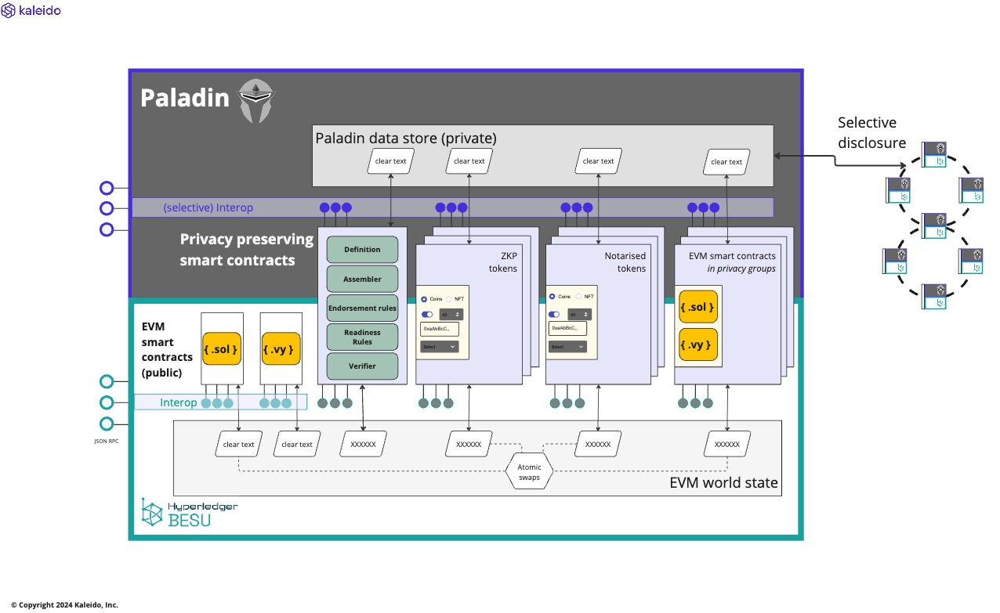

# Paladin

Paladin is a privacy preserving transaction manager for Ethereum.

## Architecture overview

<big>**⚠ WORK IN PROGRESS ⚠**</big>



- Paladin is a sidecar process that runs alongside a Hyperledger Besu node
    - Learn more about [Runtime Architecture](./architecture/runtime_architecture.md)
- Paladin provides **secure channels** of communication to other Paladins over which it can selectively disclose private data
    - Learn more about [Private Data Transports & Endpoint Registry](./architecture/data_and_registry.md)
- Paladin supports Privacy Preserving Smart Contracts, and provides samples out-of-the-box
    - Each smart contract has a part of that runs as a EVM smart contract on an **unmodified** EVM blockchain, and a part that runs as part of Paladin
      - Learn more about [ledger layers](./architecture/ledger_layers.md)
    - _Some_ implement `tokens backed by Zero-knowledge Proofs`
      - Learn more about [Zeto](./architecture/zeto.md)
    - _Some_ implement `tokens backed by Notary Certificates` (issuer/signatory endorsed tokens)
      - Learn more about [Noto](./architecture/noto.md)
    - _Some_ implement domains of `EVM Private Smart Contracts` running in `Privacy Groups` 
      - Learn more about [Pente](./architecture/pente.md)
      > Provides function similar to that provided by the [Tessera](https://github.com/consensys/tessera) project (successor to [Constellation](https://github.com/Consensys/constellation)) with additional interoperability and other enhancements
    - _All_ use the EVM base ledger as the source of truth for order and finality of transactions
    - _All_ are `atomically interoperable` via the base EVM ledger
      - Learn more about [Atomic interop of privacy preserving smart contracts](./architecture/atomic_interop.md)
    - _All_ store state in the EVM base ledger in a securely masked format preserving
        - **Confidentiality**: the data is protected via cryptography, and selectively disclosed on a need to know basis
        - **Anonymity**: the parties involved in a transaction, or set of transactions, cannot be determined without access to the confidential data
        - Learn more about [Privacy](./privacy.md)
- Paladin provides a high performance transaction manager that coordinates transaction assembly, submission and confirmation across Paladin runtimes
    - To any EVM smart contract directly on the **base EVM ledger**
    - To EVM Private Smart Contracts in **privacy groups**, backed by privacy preserving smart contracts
    - To Privacy Preserving Smart Contracts that use **UTXO models** for highly scalable private tokens
    - For atomic swaps between privacy preserving smart contracts
    - Learn more about [Distributed transaction management](./architecture/transaction_manager.md) 
- Paladin provides enterprise grade key management integration
    - Managing many keys/identities within a single Paladin runtime
    - With modular integration of remote HSM-backed key management systems
    - Supporting native Ethereum, EIP-712, and ZKP compatible cryptography
    - Learn more about [Signing and Key Management](./architecture/key_management.md) 
- Paladin provides a development, configuration, and deployment pipeline for privacy preserving smart contracts
    - Definition of the smart contract functions, inputs and events
    - Supporting EVM programmable private smart contracts and UTXO based token models
    - A set of gRPC code plug points for private lifecycle coordination and state management
        - Programming wallet functions - coin/state selection
        - Programming endorsement coordination / signature collection / sequencer selection
        - Programming transaction verification & proof generation
    - Support for `Java` and `WebAssembly` high performance code modules
    - Learn more about the [Paladin programming model](./architecture/programming_model.md)

## Dev environment setup

Install the following pre-reqs:
- JDK [version 21](https://jdk.java.net/archive/) which is compatible with [Gradle version 8.4](./gradle/wrapper/gradle-wrapper.properties)
- install [protoc](https://grpc.io/docs/protoc-installation/)
- install [docker with compose plugin](https://docs.docker.com/compose/install/)
- install npm


Run the following command to build Paladin:

```shell
./gradlew build
```

## How to run Paladin

TBD

### Build Paladin docker image

TBD

## Repo structure
This is a [Monorepo](https://en.wikipedia.org/wiki/Monorepo). To avoid overcomplicating monorepo setup, you should adhere to the following practices:
1. One folder per repo. (a "repo" contains a set of code that could be separated into a standalone Github repo)
2. You can use folders to group repos, however, nested repos are not allowed.
