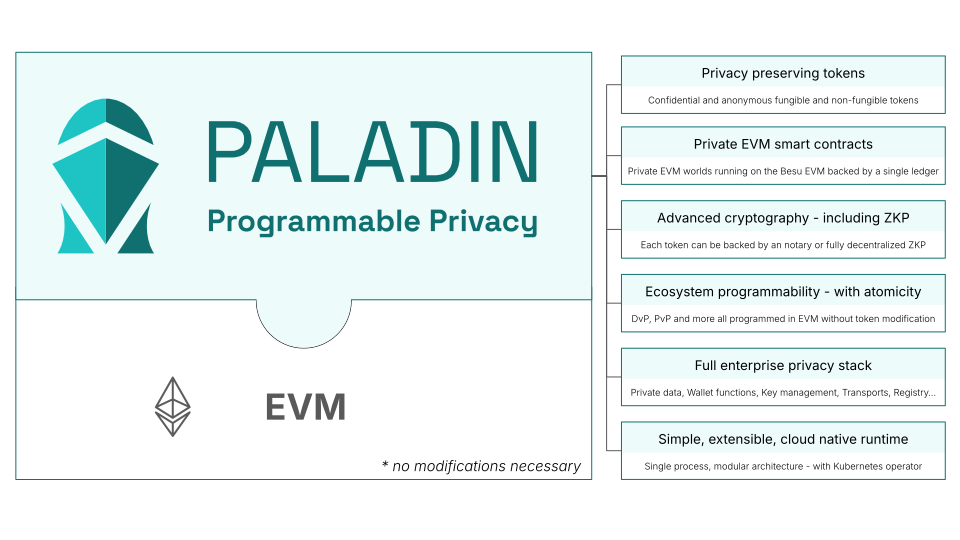
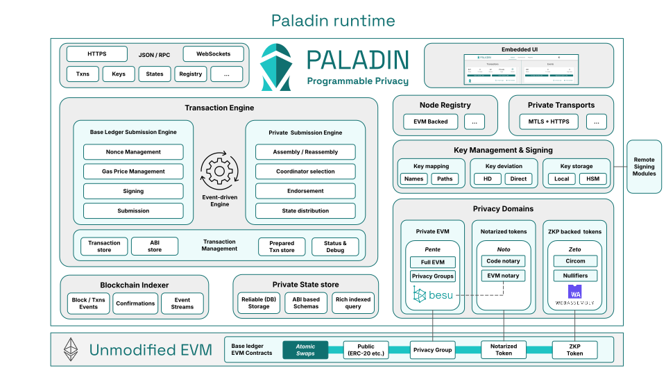
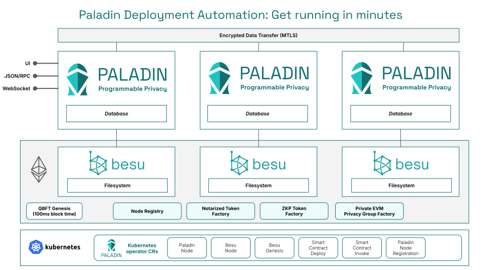

# Paladin

Paladin brings true programmable privacy to the world's most popular smart contract platform.



## Documentation

Learn more about Paladin here:

- https://lf-decentralized-trust-labs.github.io/paladin/head



## Getting started with Paladin

Get a 3-node Paladin network running with Besu on your laptop:

- https://lf-decentralized-trust-labs.github.io/paladin/head/getting-started/installation



## Getting set up for development of Paladin

Welcome!

### Building locally

Install the following pre-reqs:
- JDK - https://adoptium.net/download/
- Protoc - https://grpc.io/docs/protoc-installation/
- Docker - https://docs.docker.com/compose/install/
- NodeJS - https://nodejs.org/en/download/package-manager


Then the following command to build Paladin via Gradle:

```shell
./gradlew build
```

### Running a full development environment

Check out the operator readme:

- [operator/README.md](operator/README.md)
