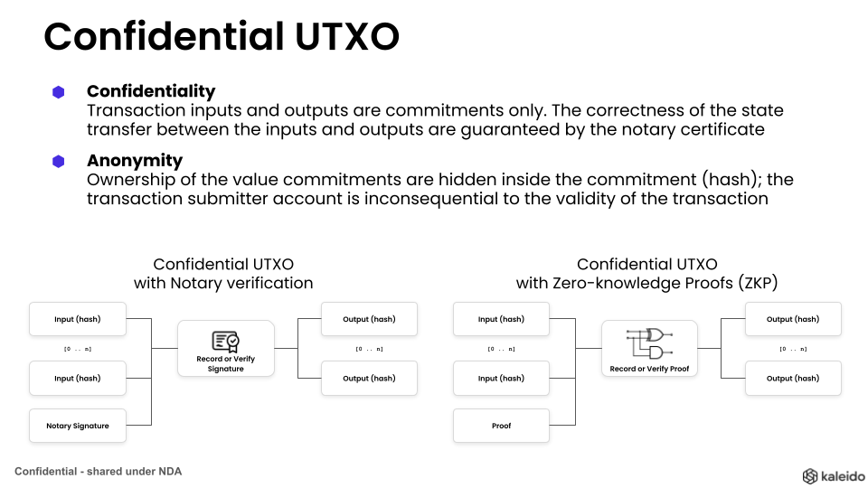

# Paladin programming model

There are three layers of programmability in Paladin for building privacy preserving smart contracts

## Layer A: Base EVM Ledger

Every privacy preserving smart contract is backed by an EVM smart contract, deployed onto the base EVM ledger of your choosing.

This base EVM can be Hyperledger Besu, or any EVM compliant ledger (permissioned or public).

> This layer must not access any private data, or leak anonymity.

The code that exists at this layer has some fundamental responsibilities:

1. Ensuring every state transition is only finalized by the blockchain if it is valid:
    - a) Verifying that an approved notary submitted the transaction
    - b) Verifying a zero-knowledge proof
    - c) Both (a) and (b)
2. Enforcing state spend protection
    - We discuss later how and why a UTXO model is most common in private transactions
3. Conforming to an interface that allows atomic interop with other smart contracts
    - Learn more in [Atomic interop of privacy preserving smart contracts](./atomic_interop.md)

### Base Ledger EVM development

You only need to develop/update smart contracts at this layer, if you have requirements that are not met by existing EVM modules provided with the Paladin project.

Examples include:

- Making changes to a ZKP based token that require a new proof verifier
- Using a mixture of approaches, such as ZKP for transfer, and notary certificates for issuance
- Adding a completely new cryptography module to the Paladin project

> TODO: Provide link to detailed developer guidance / samples / instructions

## Layer B: Private state and transaction management

Because the smart contract in the base ledger is privacy preserving, there must be code that
runs outside of the blockchain that is tightly coupled to the EVM code.

### Confidential UTXO models

By definition in a privacy preserving world, the visibility/access to the data is fragmented -
each party has a different visibility into the overall data being maintained on the ledger.

For this reason _globally_ maintained state (such as "accounts") are complex to maintain
in this layer. Instead, there is a trend towards treating the data in this layer as lots
of independent immutable records of state (fragments of the overall state) that can be salted+hashed to uniquely identify them without disclosing their contents.

These states can be encrypted and/or distributed selectively only to those parties with a right to see them.

### Wallet functions

Commonly known as "coin selection" or "state selection" logic.

In order to assemble a valid transaction, smart contract specific code is required to read
the private data known to the originator of the transaction.

This logic runs in the security context of the originator, and requires access to signing
keys that prove authority to initiate the business transaction.

Blockchain transaction consumes existing states, and produces new ones.

> Don't worry - the EVM model for state will come back in Layer C, where we define
> "privacy groups" within which programmable workflows share state/

