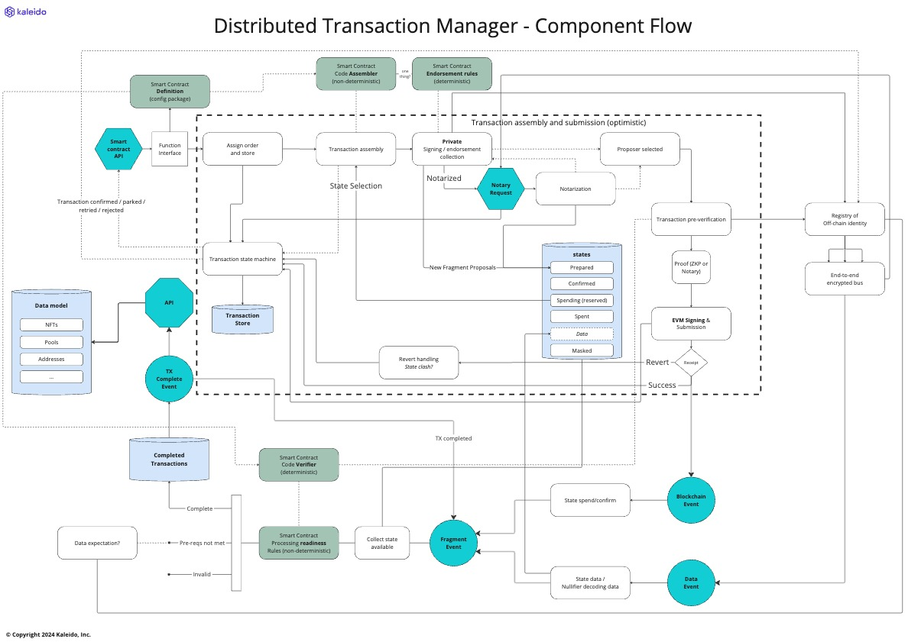
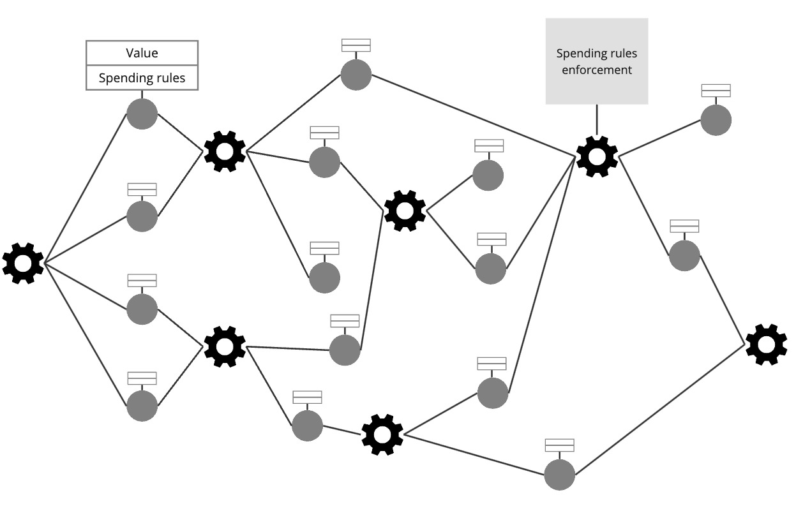

# Distributed Transaction Manager

The core function of the Paladin runtime, is it operate as a distributed transaction manager:

- Receiving API requests from applications to request new transaction submission
- Integrating with the privacy preserving smart contract code modules to orchestrate and assemble those transactions
- Communicating with other Paladin engines to notarize, endorse or submit those transactions
- Embedding a high performance state store for managing selectively disclosed private transaction state
- Integrating key management technology to sign transactions (ZKP proofs, EIP-712 signatures and Ethereum TXs)
- Processing confirmed blockchain transactions to update the state store

### Component flow

⚠ WORK IN PROGRESS ⚠

The major components of the transaction manager are highlighted in this diagram. Key items are:

- **Transaction assembly and submission**: the flow that works in a distributed manor across Paladin runtimes to assemble and submit transactions
    - Assembly of a transaction in a UTXO model means selecting a set of states that can be spent, and spending them via the rules of the contract
    - This is _optimistic_ in nature - the blockchain is the source of truth for which transaction "wins" spending an individual state
    - Collaboration between Paladin runtimes that know they might be contending to spend the same states, mitigates inefficiency
    - Paladin can construct chains of multiple transactions that can be executed in a single block where there is contention on a single state
- **Smart contract API**: the interface into a privacy preserving smart contract
    - The instructions to submit a privacy preserving smart contract are dependent on the contract itself
    - For token contracts for example, the instructions are likely to be expressed as "transfer" operations
    - For EVM Private Smart Contracts in Privacy Groups, the instructions are EVM contract deployments, and invocations
    - The inputs need to be validated and processed by code specific to the privacy preserving smart contract
- **Transaction confirmation and events**: transactions confirmed by the blockchain need to be processed against the private state view
    - Private data might arrive before or after a transaction is confirmed by the blockchain
    - A party might only be entitled to see some of the data associated with a transaction
- **Privacy preserving smart contract plug points**: each green box in the diagram is a code plug point
    - The specific technology used for each privacy preserving smart contract might be different - ZKP proofs, Private EVM processing etc.
    - A standardized interface allows multiple out-of-the-box modules to work, as well as building new modules from scratch
    - Configuration and customization is also supported

> TODO: More detailed sequence flow diagrams need to be brought into this document as they evolve

### Transaction assembly (wallet functions)

In order to assemble a valid transaction, smart contract specific code is required to select some private data in the state originator of the transaction, into .

Often referred to as known as "coin selection" logic.

This logic runs in the security context of the originator, and requires access to signing
keys that prove authority to initiate the business transaction.

Blockchain transaction consumes existing states, and produces new ones.

> Don't worry - the EVM model for state will come back in Layer C, where we define
> "privacy groups" within which programmable workflows share state/

