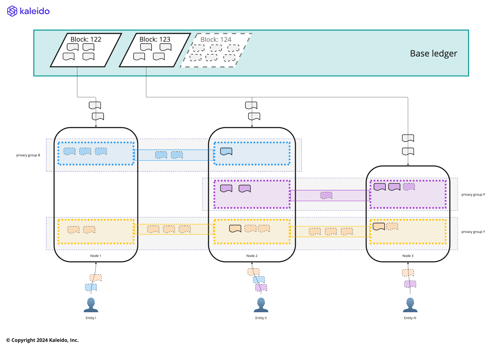
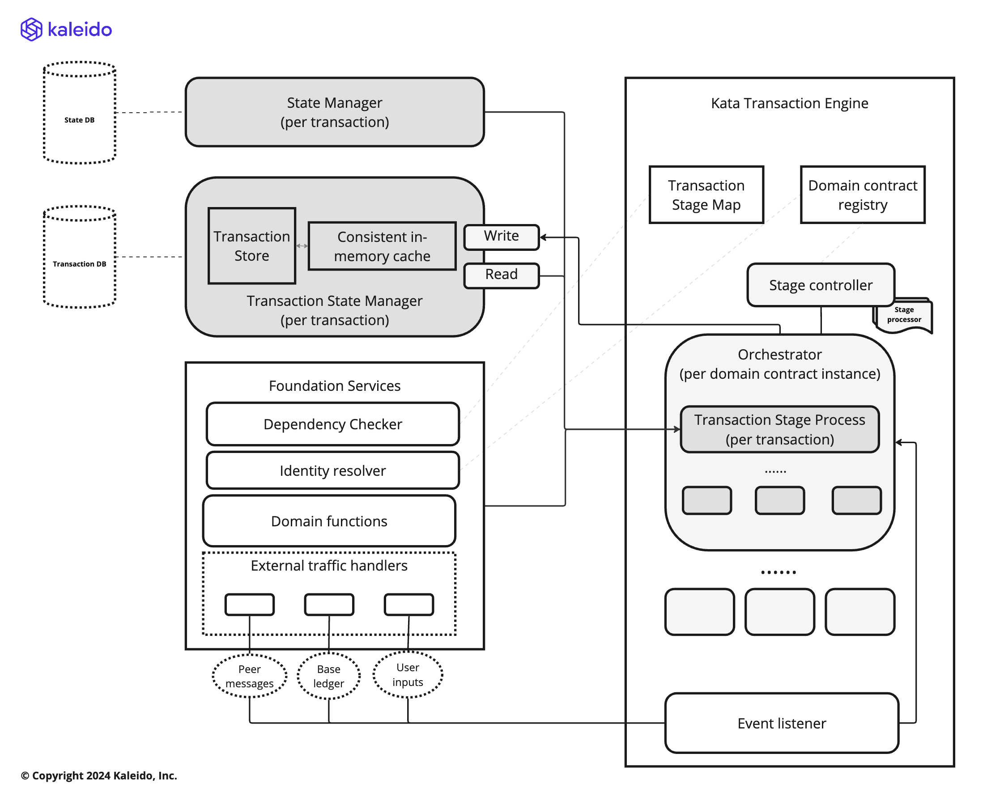

# Distributed Transaction Manager

The core function of the Paladin runtime, is to operate as a distributed transaction manager:

- Receiving API requests from applications to request new transaction submission
- Integrating with the privacy preserving smart contract code modules to orchestrate and assemble those transactions
- Communicating with other Paladin engines to notarize, endorse or submit those transactions
- Embedding a high performance state store for managing selectively disclosed private transaction state
- Integrating key management technology to sign transactions (ZKP proofs, EIP-712 signatures and Ethereum TXs)
- Processing confirmed blockchain transactions to update the state store
- Emitting streams of events to report status of submitted transactions

### Component flow

⚠ WORK IN PROGRESS ⚠

The major components of the transaction manager are highlighted in this diagram. Key items are:

- **Transaction assembly and submission**: the flow that works in a distributed manor across Paladin runtimes to assemble and submit transactions
    - Assembly of a transaction in a UTXO model means selecting a set of states that can be spent, and spending them via the rules of the contract
    - This is _optimistic_ in nature - the blockchain is the source of truth for which transaction "wins" spending an individual state
    - Collaboration between Paladin runtimes that know they might be contending to spend the same states, mitigates inefficiency
    - Paladin can construct chains of multiple transactions that can be executed in a single block where there is contention on a single state
- **Smart contract API**: the interface into a privacy preserving smart contract
    - The instructions to submit a privacy preserving smart contract are dependent on the contract itself
    - For token contracts for example, the instructions are likely to be expressed as "transfer" operations
    - For EVM Private Smart Contracts in Privacy Groups, the instructions are EVM contract deployments, and invocations
    - The inputs need to be validated and processed by code specific to the privacy preserving smart contract
- **Transaction confirmation and events**: transactions confirmed by the blockchain need to be processed against the private state view
    - Private data might arrive before or after a transaction is confirmed by the blockchain
    - A party might only be entitled to see some of the data associated with a transaction
- **Privacy preserving smart contract plug points**: each green box in the diagram is a code plug point
    - The specific technology used for each privacy preserving smart contract might be different - ZKP proofs, Private EVM processing etc.
    - A standardized interface allows multiple out-of-the-box modules to work, as well as building new modules from scratch
    - Configuration and customization is also supported

> TODO: More detailed sequence flow diagrams need to be brought into this document as they evolve (Leads John Hosie & Chengxuan Xing)

### Key design principles

In order to build an engine that works with asynchronous transaction stage update events. The Paladin transaction engine is design with the following principles:
- **Async stage based processing driven by events**: To avoid memory & CPU wasted by idle transaction tracking, an in-memory transaction stage processing pool is adopted to only track and progress pending transactions that has active actions to perform. Other pending transactions that are waiting for asynchronous responses are stored in database until the asynchronous response are detected. A stage contains one or more tasks. All transaction stage processes are trigger by one of the following events:
  - **User instructions**: transaction engine ensures user instructions are validated before any transaction stage process is initiated. If there is already a transaction stage process running, the engine will ensure the instructions are rejected/queued appropriately.  
  - **Peer messages**: messages from other nodes in the joined privacy group will be pre-scanned by the transaction engine to ensure the corresponding transaction stage process is initiated at the right time. For example, if an event contains a transaction that attempts to spend a future state, the engine will only trigger the stage process when the future state is discovered.
  - **Base EVM ledger events**: events from the tracked privacy preserving contracts drives the finalization of Paladin transactions. The engine will coordinate and trigger associated completion and rollbacks.

- **Efficient dependency checks**: A single Paladin node will need to handle transactions from multiple privacy preserving contracts and multiple UTXO states within each privacy preserving contracts. Paladin transaction engine maintains core transaction status information that are discovered through handling transaction events and stage tasks to provide efficient dependency checks. The transaction engine is designed to be the gate for all transaction record updates so that it can maintain data integrity of the core tracking information.

- **Critical changes must be persisted between stage tasks**: in the situations the transaction stage processor are switching between different stage tasks, any critical changes from the previous task must be persisted on-disk before the next task is triggered. This is to ensure the engine can resume transaction process with the correct context without losing critical information. The stage tasks themselves must be designed with idempotency in mind, so retries with persisted information do not cause unexpected behavior.

### Stage processor development

Stage processors is the glue between the generic transaction engine & orchestrators and the domain-specific logic of stage tasks.

Responsibilities of the transaction engine:

- it will ensure any provided transaction record update will be persisted between stage tasks and stages.
- it invokes stage action at the right time (e.g. detect dependency satisfaction based on the stage logic).
- it filters out outdated transaction events based. 

Responsibilities of stage processors:

- it provides stage specific logic for the generic stage control functions that the transaction engines utilizes
- it generates transaction information that can be used by transaction engine to do dependency check and event filtering
- it uses instructions to communicate with the transaction engine for task and stage switch
- it divides a stage into multiple tasks and decide critical changes between tasks
- it ensures critical changes are always persisted before performing the affected tasks
