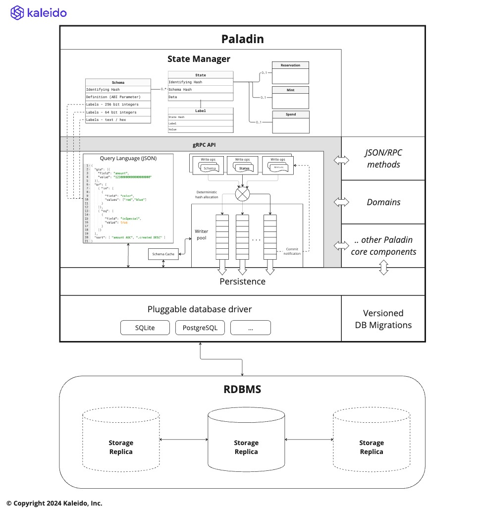

# UXTO State Store

As discussed in [Programming Model](./programming_model.md) each of the privacy preserving smart
contract domains of a Paladin runtime has a layer of code that must efficiently access private states.

The nature of private states being selectively disclosed, means the model most commonly used to
manage the relationships between these states is a the Unspent Transaction Output (UTXO) model.

> This includes domains like [Pente](./pente.md) that implement EVM programmability on top of these states,
> with each UTXO representing the current state of a private EVM smart contract


## Guiding architectural principals

The Paladin architecture is optimized to store and query these selectively disclosed UTXO states efficiently.

Some guiding principles that underpin this architecture are as follows:

1. Domains must be able to query the state store efficiently, and flexibly
2. Data must be hashable in a way it can be attested to on the base blockchain and in zero knowledge proofs
3. Each domain must be able to store completely different data in its private states
4. Web3 solutions primarily use fixed-point arithmetic with large 256bit numbers, rather than floating point
5. States must be self-contained so they can be transmitted between Paladin runtimes efficiently
6. Private state storage must be very reliable, as (unlike the base blockchain) only one party might hold the state
7. States are immutable - per UTXO semantics
8. States might need to be persisted a long time before, or after, the blockchain transactions that confirm or spend them

### Architecture



Due to the fact that we cannot rely on the consensus algorithm and validators of the base ledger
to retain backup copies of private data, Paladin is optimized for enterprise RDBMS systems that
provide replicated data storage.

Any SQL based RDBMS database is supported, and DDL migrations are provided for various databases.
The architecture is flexible such that other fundamental types of storage can be added in the future
(NoSQL / document based for example).

These types of database provide indexing, sorting and querying facilities alongside resilience. This is important
to allow sophisticated state / coin selection algorithms to be run in the domains.

## Dynamic indexes: Schemas and Labels

The storage is structured in the SQL layer, so that fast indexed `labels` can be dynamically applied to `states`
without any change to the table layout in the RDBMS.

However, for efficiency in the query system it is important that the list of possible labels, and their **data types**
can be known ahead of time for each state that is stored.

To do this a `schema` must be stored by a domain, before any `states` are stored.

- Schemas are isolated to a domain
- Schemas are identified by a hash (just like states)
- A matching schema must exist to receive a state into the Paladin engine

## ABI Type System

Rather than inventing a new type system for Paladin, we incorporate the well established type system of the
Ethereum ecosystem used in the Ethereum Application Binary Interface (ABI).

Specifically we support the subset that the [ERC-712](https://github.com/ethereum/EIPs/blob/master/EIPS/eip-712.md)
`TypedData` standard accommodates, as this standard fits the model of structured data very closely to
what is required for our UTXO states.

When creating a schema using an ABI definition (JSON) we:
- Require a single type definition of type `tuple` (not an array, or a function definition)
- Require the `"internalType": "struct StructName` extension of ABI is used to define all `tuple` names
- Use the `indexed` boolean parameter on the _top level_ type to specify the `labels` 

> The schema system is pluggable such that other schema types can be plugged in, for example if a domain
> wished to use JSON Schema with special annotations to describe the data schema and a different hashing.

### Supported types

The following types can be used in structures, and also as `indexed` fields that 
are available for **searching** and **sorting**.

This includes supporting 256bit integers, as most coins are implemented using
large whole numbers with a designated number of decimals (such as 18).

The query syntax supports supplying the values in many different ways (decimal, hex,
with/without `0x` prefix etc.). These are transformed to a standard format for efficient
indexed filtering/sorting in the backing SQL database as follows.

| Type                  | Indexed in the database as                                 |
|-----------------------|------------------------------------------------------------|
| `string`              | Text                                                       |
| `bytes1` to `bytes32` | Bytes (encoded as hex)                                     |
| `bytes`               | Bytes (encoded as hex)                                     |
| `uint8` to `uint63`   | 8 byte signed numbers (note `uint64` too large in SQL)     |
| `int8` to `int64`     | 8 byte signed numbers                                      |
| `uint64` to `uint256` | 64 character fixed width big-endian hex                    |
| `address`             | Identically to `uint160`                                   |
| `int65` to `int256`   | 65 character two's compliment hex strings with sign prefix |
| `bool`                | The same as `int64(0)`/`int64(1)` for `false`/`true`       |

> Performance tip: Use `int64` for all numbers that do not require 256bit precision,
> such as timestamps and whole values. Avoid using `uint64` - it is the same cost
> as `uint256`

## JSON input/output

While we use the ABI type system, and schema definition language, the data itself can come in and out
of the Paladin node in JSON format as the primary exchange format for that data.

The data itself is stored directly into the database as a blob, so that when it is returned
to the domain all values embedded are available - not just those that have been indexed for query.

The system uses JSON in the database (mainly to make debugging easy vs. a binary format like ABI+RLP),
but it re-serializes it according to the ABI schema. This means that:

1. No fields that are not included in the `TypedData` are included
2. Consistent formatting of values like numbers (strings in decimal) and bytes (hex with `0x` prefix)

Domains can be coded to expect their JSON data to be standardized in this way, and do not need to worry
about the various ways end-users might supply logically equivalent data.

## Hashing

In addition to following the ABI / EIP-712 type system, we also use the EIP-712 `hashStruct(message)` algorithm
(specifically Version 4 of that algorithm) to deterministically generate a hash for the data.

## Query language

The query language is flexible, with access to the full power of the SQL query system.

> TODO: Provide some more detail on the semantics of this JSON - probably in a reference section, rather than
> architecture as this is externalized on JSON/RPC

```json
{
  "gte": [{
    "field": "amount",
    "value": "12300000000000000000"
  }],
  "or": [
    { "in": [
      {
        "field": "color",
        "values": ["red","blue"]
      }
    ]},
    { "eq": [
      {
        "field": "isSpecial",
        "value": true
      }
    ]}
  ],
  "sort": [ "amount ASC", ".created DESC" ]
}
```
