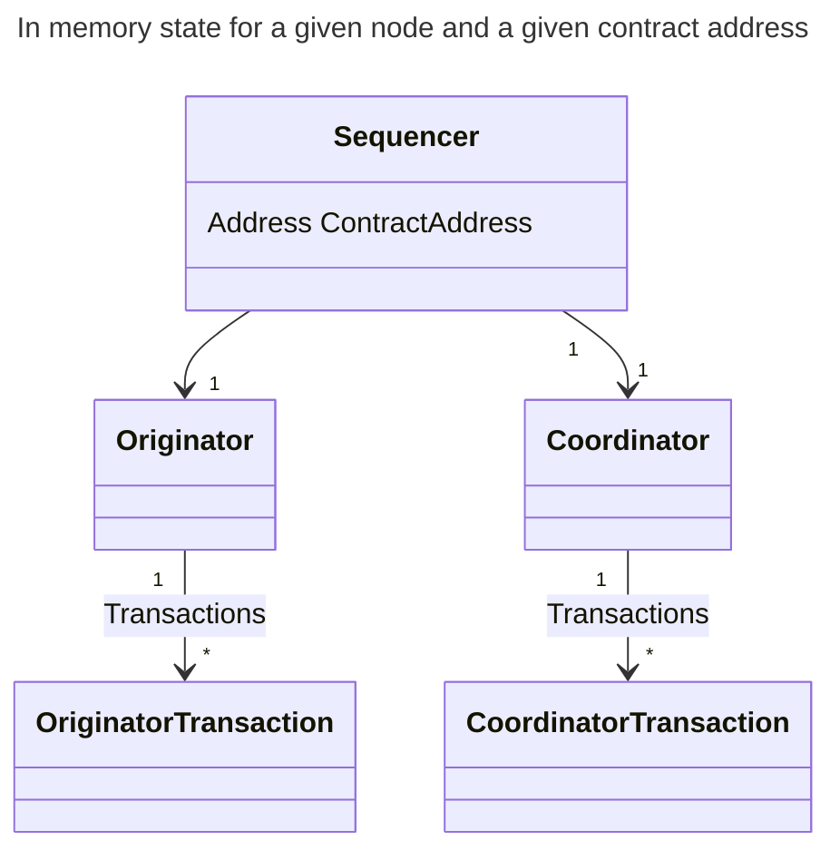

# Architecture

Paladin is made up of a number of discrete components, each of which handles different responsibilities within the runtime.

The distributed sequencer is one of those standalone components and the sequencer manager handles the lifetime of sequencers for different domain contracts.

The distributed sequencer is implemented using [state machines](./distributed_sequencer_state_machine.md) to track activity in the [2 core components](#sequencer-components) of the sequencer (the `originator` and the `coordinator`).

For every active sequencer the state machines are updated by generating, receiving (from other nodes), and processing state machine events. The order that state machine events are handled is critical for reliable transaction processing. The sequencer architecture uses several event handling queues, implemented using Golang channels, to maintain this ordering.

## Sequencer Components

In domains (such as Pente) where the spending rules for states allow any one of a group of parties to spend the state, then we need to coordinate the assembly of transactions across multiple nodes so that we can maximize the throughput by speculatively spending new states and avoiding transactions being reverted due to double spending / state contention.

To achieve this, it is important that we have an algorithm that allows all nodes to agree on which of them should be selected as the coordinator at any given point in time. And all other nodes delegate their transactions to the coordinator.

A node uses a sequencer to coordinate transactions with a domain contract:

The sequencer manages the overall lifecycle of transactions submitted to the node. The sequencer comprises 2 sub-components:

### Originator

The originator is responsible for delegating transactions submitted to the node, to an active coordinator. It performs assembly of delegated transactions when instructed to do so by the coordinator.

### Coordinator

The coordinator orchestrates the assembly of all transactions for a domain instance. For a given domain instance there can only be one tranasction being assembled at a time. The coordinator maintains a pool
of delegated transactions, selects them in turn for assembly, and orchestrates the endorsement of them.

A coordinator may not always be active on every node participating in the private contract (see below).

For each node, for each active private contract, there is one instance of the `Sequencer` in memory. The `Sequencer` contains sub components for the `Originator` and `Coordinator`. The `Originator` is responsible for keeping track of transactions sent, including delegating them to the active coordinator (which may be on a different node) and responding to requests to assemble its tranasctions. The `Coordinator` is responsible for coordinating the assembly and submission of transactions from all `Originators`.

## Sequencer lifecycle

Paladin runs a dedicated sequencer for every domain contract it is actively processing transactions for. The sequencers used for different contracts have specific committee members, originator nodes, and coordination behaviours.

Some contracts will be single-use (or very infrequent use) where others may regularly have new transactions being submitted. Paladin manages the lifecycle of every sequencer to avoid runtime resources being used if no transactions are actively being handled for a given domain instance.

The seqencer lifecycle management built in to Paladin is highly configurable, but the default configuration is intended to provide:

- minimal resource consumption for infrequently used contracts
  - a sequencer will be removed from memory when not in use
- minimal latency for frequently used contracts
  - a sequencer will not be removed from memory if it is actively processing transactions
- stability of the Paladin runtime by limited the overall number of sequencers which are active at a given time

The following sequence diagram shows the lifecycle of a sequencer for a newly submitted transaction:

{.zoomable-image}
{.zoomable-image}

## Event driven state machines

The distributed sequencer is built using [state machines](./distributed_sequencer_state_machine.md) to track the coordinator, originator, and their transactions. A single goroutine called the `event loop` processes all events for the coordinator and originator respectively. This ensures thread safe updating of the state machines.

The state machines are updated by the event loop processing events. Events typically result in a transition between the states and in some cases result in specific actions being carried out before or during the transition.

Events can be received from sources external to the node (such as another node), or internally from a state machine producing events as a result of processing other ones.

The following diagram demonstrates how events are passed to the state machines and how events are processed in one of two priority categories. Priority events are always processed first by the relevant state machine, while regular events are processed whenever there are no priority events to handle:

{.zoomable-image}
{.zoomable-image}

The [state machine](./distributed_sequencer_state_machine.md)'s handling of events can in some cases require it to create and immediately process a new event. This allows the state machine to ensure particular updates are processed synchronously.
