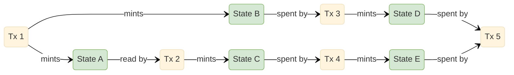
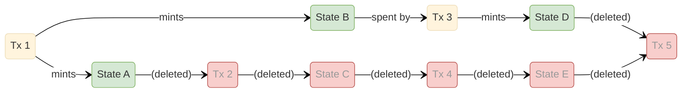
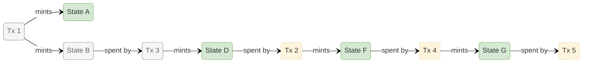
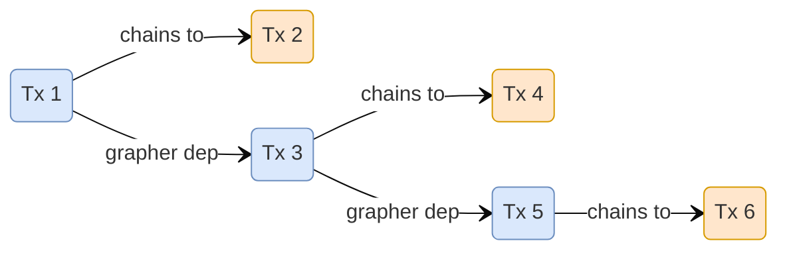

# Transaction dependencies

Paladin transactions can produce new states (e.g. minting new tokens), consume existing states (e.g. spending an existing token) or both.

The states created and consumed by a transaction are determined when the originator node assembles the transaction. The originator will create and select states based on its assembly implementation.

It is common for multiple Paladin transactions to be related to each other in terms of their state changes. An example would be that TX1 creates a state by minting a new token and TX2 consumes that state by transfering the token to another identity. Paladin tracks transaction state changes through its use of a `grapher` component. If a transaction creates a state that another transaction consumes, it is said to be a `pre-req` of that transaction. The `grapher` component maintains `pre-req` links between transaction based on the output of the assembly phase and makes certain decisions based on the `grapher`.

The coordinator tracks transaction dependencies through three complementary components: the **Grapher** and the **Dependency Tracker**. Together they ensure transactions are assembled and dispatched in a safe order to prevent failure of their base-ledger transactions.

## Pre-assemble dependencies

When multiple transactions are delegated from an originator to a coordinator, the coordinator ensures that the **first** attempt to assemble the transactions is performed in the order they were delegated.

Subsequent assembly requests (for example if the initial assembly results in a retryable revert error) will be performed in non-deterministic order. The grapher (see below) will still ensure that state mints and spends are tracked so out-of-order processing will still result in safe transaction submission to the base ledger.

## Post assembly dependencies

States and locks are the intermediaries that link transactions together. When a transaction reads or spends a state, it implicitly depends on the transaction that minted it. The **Grapher** and **Dependency Tracker** components track these dependencies.

In the example above:

- **Tx 1** has no dependencies. It mints State A and State B, making it the root of two independent chains.

- **Tx 2** reads State A. Because the grapher knows Tx 1 minted State A, Tx 2 acquires a post-assembly dependency on Tx 1. Tx 2 also mints State C, extending the first chain.

- **Tx 3** spends State B. This gives it a post-assembly dependency on Tx 1 via the second chain. Tx 3 mints State D as its output.

- **Tx 4** spends State C, making it dependent on Tx 2 (and transitively on Tx 1). It mints State E as its output.

- **Tx 5** spends both State D (minted by Tx 3) and State E (minted by Tx 4). The grapher therefore records post-assembly dependencies on both Tx 3 and Tx 4. Tx 5 cannot be dispatched until both chains have confirmed.

If **Tx 2** fails on the base ledger, the grapher removes all dependency links that flow through it. State C and State E are no longer valid, and Tx 4 loses its input. The surviving chain (Tx 1 → State B → Tx 3 → State D) is unaffected.

Depending on the domain assembly logic and the inputs to the transactions, when TX2 is re-assembled it will potentially consume the state minted by TX3:

## Chained transaction dependencies

Some transactions produce new private transactions as a side-effect of their execution — for example, a Notarized token mint that internally creates a follow-on private smart contract invocation. The sequencer tracks these as **chained** dependencies:

Each transaction produces at most one chained child. **Tx 1** produces **Tx 2** (chained), and is also a grapher prerequisite of **Tx 3** — Tx 3 reads or spends a state minted by Tx 1. **Tx 3** in turn produces its own chained child **Tx 4**, and is a grapher prerequisite of **Tx 5**. **Tx 5** produces its own chained child **Tx 6**.

Unlike post-assembly dependencies (which are discovered from shared state), chained dependencies are registered when the parent transaction's domain implementation creates the child transaction.

## Application dependencies

Applications can declare explicit dependencies between transactions across different domains. These are not tracked by the **Grapher** or **Dependency Tracker** packages but are instead handled before delegation to a coordinator. They allow multi-domain workflows to enforce ordering where there is no shared private state for the grapher to automatically infer dependencies. If an application has a requirement to ensure that a transaction isn't processed until a prior transaction has been successful, application or "explicit" dependencies can be stipulated in the submitted transaction.

```mermaid
%%{init: {'theme': 'base', 'themeVariables': {'edgeLabelBackground': '#ffffff'}}}%%
stateDiagram-v2
    direction LR

    classDef domain1Cls fill:#dae8fc,stroke:#6c8ebf,color:#333
    classDef domain2Cls fill:#d5e8d4,stroke:#82b366,color:#333
    classDef domain3Cls fill:#ffe6cc,stroke:#d79b00,color:#333
    classDef domain4Cls fill:#e1d5e7,stroke:#9673a6,color:#333

    Tx1 : Tx 1 (Domain 1)
    Tx2 : Tx 2 (Domain 2)
    Tx3 : Tx 3 (Domain 3)
    Tx4 : Tx 4 (Domain 4)

    class Tx1 domain1Cls
    class Tx2 domain2Cls
    class Tx3 domain3Cls
    class Tx4 domain4Cls

    Tx1 --> Tx2 : app dep
    Tx2 --> Tx3 : app dep
    Tx3 --> Tx4 : app dep
```

Each transaction belongs to a different domain. The application has declared that they must execute in order — Tx 2 cannot proceed until Tx 1 completes, and so on down the chain.
