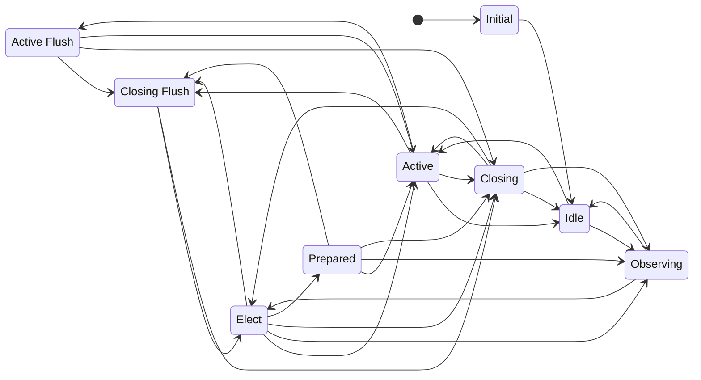
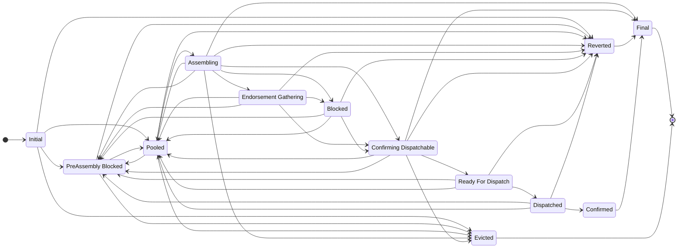
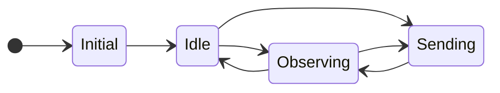
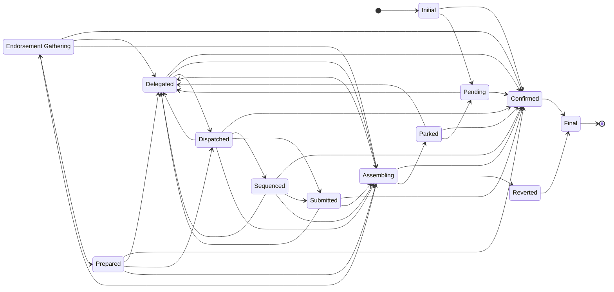

# Sequencer and transaction state machines

The distributed sequencer is designed as a set of state machines, each of which manages the state of the sequencer components (originator and coordinator) and of sequencer transactions (at the originator and at the coordinator).

*Auto-generated from source*

## Coordinator State Machine

### States

| State | Description |
| --- | --- |
| **Initial** | Coordinator state machine created |
| **Idle** | Not actively coordinating and not aware of any other active coordinators |
| **Observing** | Not actively coordinating but aware of another node actively coordinating |
| **Elect** | Has sent a handover request to an active coordinator and is waiting for that node to stop coordinating |
| **Prepared** | Has seen the previous active coordinator begin to flush and is waiting for the flush to complete |
| **Active** | Actively coordinating transactions for this domain instance |
| **Active Flush** | Draining dispatched transactions while still the active coordinator (key-rotation) |
| **Closing Flush** | Draining dispatched transactions after stepping down (preemption) |
| **Closing** | Has flushed and is continuing to send closing status for configured number of heartbeats |

---

## Coordinator Transaction State Machine

### States

| State | Description |
| --- | --- |
| **Initial** | Transaction state machine has been created |
| **Pooled** | The transaction is waiting in the pool to be selected and sent for assembly to the its originator |
| **PreAssembly Blocked** | The transaction cannot yet be put in the pool to be selected for assembly because a dependency must be assembled first |
| **Assembling** | An assemble request has been sent to the originator and we are waiting for the response |
| **Reverted** | The transaction has been reverted, either at assembly time by the originator or on the base ledger |
| **Endorsement Gathering** | The transaction has been successfully assembled and endorsement requests have been sent |
| **Blocked** | All endorsements have been received but the transaction cannot proceed due to dependencies not being ready for dispatch |
| **Confirming Dispatchable** | The transaction has been endorsed. Confirmation from the originator is required before the transaction can be dispatched. The originator may still request not to proceed at this point. |
| **Ready For Dispatch** | Dispatch confirmation has been received from the originator and the transaction is waiting to be collected by the dispatch goroutine |
| **Dispatched** | Collected by the dispatcher thread and submitted by the public TX manager to the base ledger |
| **Confirmed** | The transaction has been confirmed on the base ledger. It will remain in this state for a number heartbeat intervals before moving to State_Final to removed from memory. |
| **Final** | The transaction will be removed from memory upon entry to this state |
| **Evicted** | A problematic transaction is being evicted. Transactions are removed from memory upon entry to this this state. Distinct from State_Final because it might just be used for memory or in-flight slot management |

---

## Originator State Machine

### States

| State | Description |
| --- | --- |
| **Initial** | Waiting for initial coordinator selection |
| **Idle** | Not acting as an originator and not aware of any active coordinators |
| **Observing** | Not acting as an originator but aware of a node (which may be the same node) acting as a coordinator |
| **Sending** | Has some transactions that have been delegated to a coordinator but not yet confirmed |

---

## Originator Transaction State Machine

### States

| State | Description |
| --- | --- |
| **Initial** | Transaction state machine created |
| **Pending** | The transaction has not yet been delegated to a coordinator |
| **Delegated** | The transaction has been sent to the current active coordinator |
| **Assembling** | The coordinator has sent an assemble request to us and we have not yet sent the assembled transaction back to the coordinator |
| **Endorsement Gathering** | An assemble response has been sent to the active coordinator, who should now be gathering endorsements for the transaction. A dispatch confirmation request is expected in this state. |
| **Prepared** | We know that the coordinator has got as far as preparing a public transaction for this transaction |
| **Dispatched** | The active coordinator that this transaction was delegated to has dispatched the transaction to a public transaction manager for submission to the base ledger |
| **Sequenced** | The public transaction manager at the coordinator has allocated a nonce for this transaction's base ledger transaction |
| **Submitted** | The base ledger transaction has been submitted to the blockchain |
| **Confirmed** | The base ledger transaction has been confirmed by the blockchain as successful |
| **Reverted** | Upon attempting to assemble the transaction, the domain code has determined that the intent is not valid and the transaction is finalized as reverted |
| **Parked** | Upon attempting to assemble the transaction, the domain code has determined that the transaction is not ready to be assembled and it is parked for later processing. Other transactions for the current originator can continue unless they have an explicit dependency on this transaction. |
| **Final** | Final state for the transaction. Transactions are removed from memory as soon as they enter this state |
