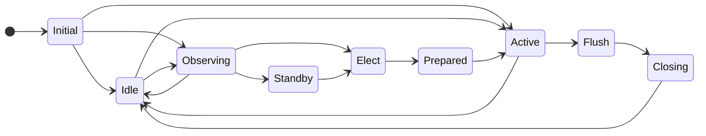
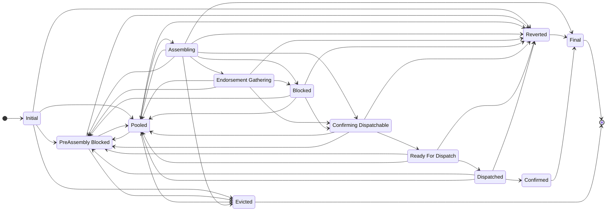
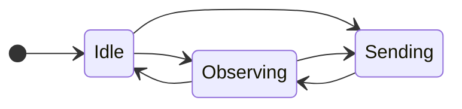
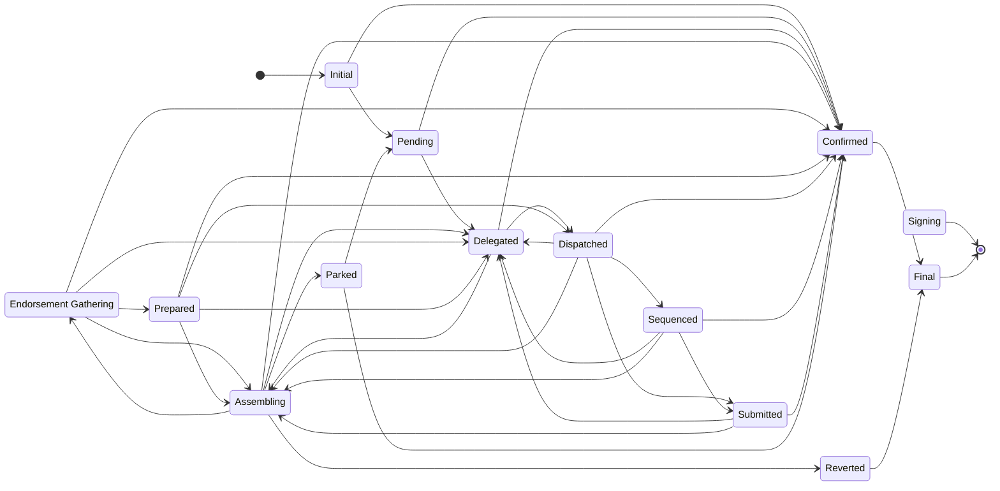

# Sequencer and transaction state machines

The distributed sequencer is designed as a set of state machines, each of which manages the state of the sequencer components (originator and coordinator) and of sequencer transactions (at the originator and at the coordinator).

## Coordinator State Machine

### States

| State | Description |
| --- | --- |
| **Initial** | Coordinator created but not yet selected an active coordinator |
| **Idle** | Not acting as a coordinator and not aware of any other active coordinators |
| **Observing** | Not acting as a coordinator but aware of another node acting as a coordinator |
| **Elect** | Elected to take over from another coordinator and waiting for handover information |
| **Standby** | Going to be coordinator on the next block range but local indexer is not at that block yet. |
| **Prepared** | Have received the handover response but haven't seen the flush point confirmed |
| **Active** | Have seen the flush point or have reason to believe the old coordinator has become unavailable and am now assembling transactions based on available knowledge of the state of the base ledger and submitting transactions to the base ledger. |
| **Flush** | Stopped assembling and dispatching transactions but continue to submit transactions that are already dispatched |
| **Closing** | Have flushed and am continuing to sent closing status for `x` heartbeats. |

---

## Coordinator Transaction State Machine

### States

| State | Description |
| --- | --- |
| **Initial** | Initial state before anything is calculated |
| **Pooled** | waiting in the pool to be assembled - TODO should rename to "Selectable" or "Selectable_Pooled".  Related to potential rename of `State_PreAssembly_Blocked` |
| **PreAssembly Blocked** | has not been assembled yet and cannot be assembled because a dependency never got assembled successfully - i.e. it was either Parked or Reverted is also blocked |
| **Assembling** | an assemble request has been sent but we are waiting for the response |
| **Reverted** | the transaction has been reverted by the assembler/originator |
| **Endorsement Gathering** | assembled and waiting for endorsement |
| **Blocked** | is fully endorsed but cannot proceed due to dependencies not being ready for dispatch |
| **Confirming Dispatchable** | endorsed and waiting for confirmation that were are OK to dispatch. The originator can still request not to proceed at this point. |
| **Ready For Dispatch** | dispatch confirmation received and waiting to be collected by the dispatcher thread.Going into this state is the point of no return |
| **Dispatched** | collected by the dispatcher/public TX manager and in-flight on base ledger |
| **Confirmed** | "recently" confirmed on the base ledger.  NOTE: confirmed transactions are not held in memory for ever so getting a list of confirmed transactions will only return those confirmed recently |
| **Final** | final state for the transaction. Transactions are removed from memory as soon as they enter this state |
| **Evicted** | evicted state for a problematic transaction. Transactions are removed from memory as soon as they enter this state. Distinct from State_Final because it might just used for memory or in-flight slot management |

---

## Originator State Machine

### States

| State | Description |
| --- | --- |
| **Idle** | Not acting as a originator and not aware of any active coordinators |
| **Observing** | Not acting as a originator but aware of a node (which may be the same node) acting as a coordinator |
| **Sending** | Has some transactions that have been sent to a coordinator but not yet confirmed TODO should this be named State_Monitoring or State_Delegated or even State_Sent.  Sending sounds like it is in the process of sending the request message. |

---

## Originator Transaction State Machine

### States

| State | Description |
| --- | --- |
| **Initial** | Initial state before anything is calculated |
| **Pending** | Intent for the transaction has been created in the database and has been assigned a unique ID but is not currently known to be being processed by a coordinator |
| **Delegated** | the transaction has been sent to the current active coordinator - we do not know that the coordinator has accepted the transaction as there is no confirmation response to a delegation request, but the delegate loop will trigger a periodic retry |
| **Assembling** | the coordinator has sent an assemble request that we have not replied to yet |
| **Endorsement Gathering** | we have responded to an assemble request and are waiting the coordinator to gather endorsements and send us a dispatch confirmation request |
| **Signing** | we have assembled the transaction and are waiting for the signing module to sign it before we respond to the coordinator with the signed assembled transaction |
| **Prepared** | we know that the coordinator has got as far as preparing a public transaction and we have sent a positive response to a coordinator's dispatch confirmation request but have not yet received a heartbeat that notifies us that the coordinator has dispatched the transaction to a public transaction manager for submission |
| **Dispatched** | the active coordinator that this transaction was delegated to has dispatched the transaction to a public transaction manager for submission |
| **Sequenced** | the transaction has been assigned a nonce by the public transaction manager |
| **Submitted** | the transaction has been submitted to the blockchain |
| **Confirmed** | the public transaction has been confirmed by the blockchain as successful |
| **Reverted** | upon attempting to assemble the transaction, the domain code has determined that the intent is not valid and the transaction is finalized as reverted |
| **Parked** | upon attempting to assemble the transaction, the domain code has determined that the transaction is not ready to be assembled and it is parked for later processing.  All remaining transactions for the current originator can continue - unless they have an explicit dependency on this transaction |
| **Final** | final state for the transaction. Transactions are removed from memory as soon as they enter this state |
