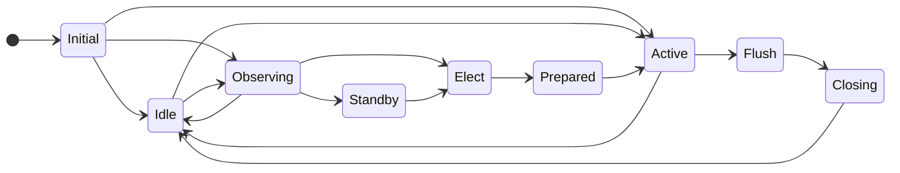
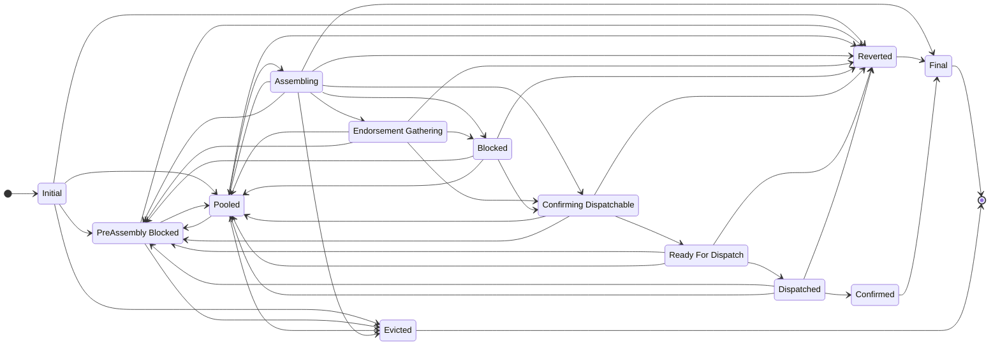
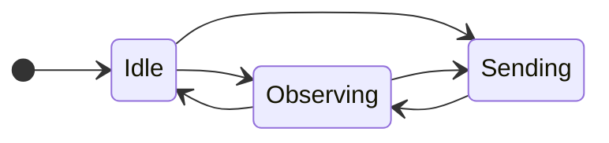
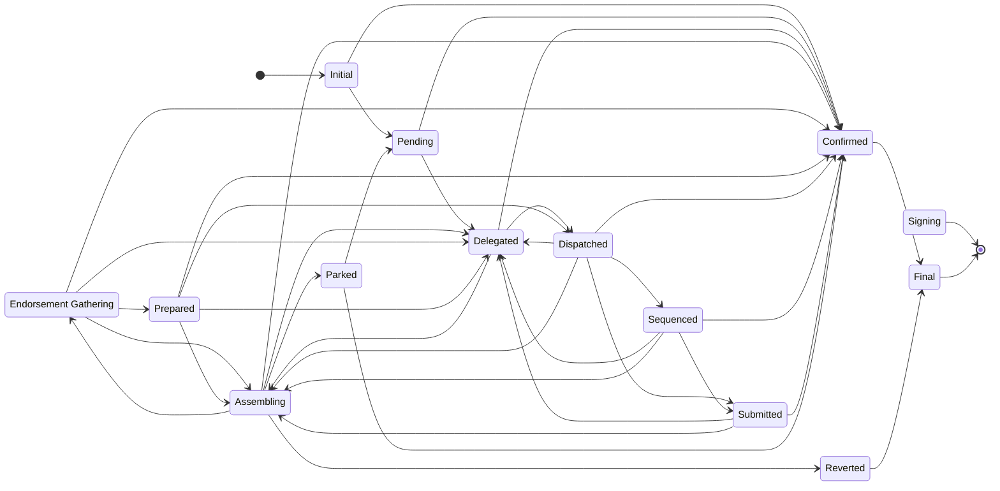

# Sequencer and transaction state machines

The distributed sequencer is designed as a set of state machines, each of which manages the state of the sequencer components (originator and coordinator) and of sequencer transactions (at the originator and at the coordinator).

*Auto-generated from source*

## Coordinator State Machine

### States

| State | Description |
| --- | --- |
| **Initial** | Coordinator created |
| **Idle** | Not acting as a coordinator and not aware of any other active coordinators |
| **Observing** | Not acting as a coordinator but aware of another node acting as a coordinator |
| **Elect** | Elected to take over from another coordinator and waiting for handover information |
| **Standby** | Going to be coordinator on the next block range but local indexer is not at that block yet |
| **Prepared** | Have received the handover response but haven't seen the flush point confirmed |
| **Active** | Actively coordinating transactions for this domain instance |
| **Flush** | Stopped dispatching new transactions but continuing to process transactions that are already dispatched |
| **Closing** | Have flushed and am continuing to send closing status for configured number of heartbeats |

---

## Coordinator Transaction State Machine

### States

| State | Description |
| --- | --- |
| **Initial** | Transaction state machine created |
| **Pooled** | Waiting in the pool to be selected and sent for assembly to the transaction's originator |
| **PreAssembly Blocked** | Has not been assembled yet and cannot be assembled because a dependency never got assembled successfully, typically because it was parked or reverted |
| **Assembling** | An assemble request has been sent to the originator and we are waiting for the response |
| **Reverted** | The transaction has been reverted at assembly time by the originator |
| **Endorsement Gathering** | Assembly completed successfully and we are now waiting for endorsement of the assembled transaction |
| **Blocked** | All endorsements have been received but the transaction cannot proceed due to dependencies not being ready for dispatch |
| **Confirming Dispatchable** | Endorsed and waiting for confirmation that were are OK to dispatch. The originator can still request not to proceed at this point. |
| **Ready For Dispatch** | Dispatch confirmation has been received from the originator and we are waiting to be collected by the dispatcher thread. Going into this state is the point of no return to the base ledger. |
| **Dispatched** | Collected by the dispatcher thread and submitted by the public TX manager to the base ledger |
| **Confirmed** | Confirmed on the base ledger in recent blocks.  NOTE: confirmed transactions are not held in memory for ever so getting a list of confirmed transactions will only return those confirmed recently |
| **Final** | Final state for the transaction. Transactions are removed from memory as soon as they enter this state |
| **Evicted** | Evicted state for a problematic transaction. Transactions are removed from memory as soon as they enter this state. Distinct from State_Final because it might just be used for memory or in-flight slot management |

---

## Originator State Machine

### States

| State | Description |
| --- | --- |
| **Idle** | Not acting as an originator and not aware of any active coordinators |
| **Observing** | Not acting as an originator but aware of a node (which may be the same node) acting as a coordinator |
| **Sending** | Has some transactions that have been delegated to a coordinator but not yet confirmed |

---

## Originator Transaction State Machine

### States

| State | Description |
| --- | --- |
| **Initial** | Transaction state machine created |
| **Pending** | Intent for the transaction has been created in the database and has been assigned a unique ID but is no confirmation yet that a coordinator is processing it |
| **Delegated** | The transaction has been sent to the current active coordinator - we do not know that the coordinator has accepted the transaction as there is no confirmation response to a delegation request but heartbeats will confirm this indirectly |
| **Assembling** | The coordinator has sent an assemble request to us and we have not yet sent the assembled transaction back to the coordinator |
| **Endorsement Gathering** | We have responded to an assemble request and are waiting the coordinator to gather endorsements before sending us a dispatch confirmation request |
| **Signing** | We have assembled the transaction and are waiting for the signing module at the coordinator to sign the respective base ledger transaction |
| **Prepared** | We know that the coordinator has got as far as preparing a public transaction for this transaction |
| **Sequenced** | The public transaction manager at the coordinator has allocated a nonce for this transaction's base ledger transaction |
| **Dispatched** | The active coordinator that this transaction was delegated to has dispatched the transaction to a public transaction manager for submission to the base ledger |
| **Submitted** | The base ledger transaction has been submitted to the blockchain |
| **Confirmed** | The base ledger transaction has been confirmed by the blockchain as successful |
| **Reverted** | Upon attempting to assemble the transaction, the domain code has determined that the intent is not valid and the transaction is finalized as reverted |
| **Parked** | Upon attempting to assemble the transaction, the domain code has determined that the transaction is not ready to be assembled and it is parked for later processing. Other transactions for the current originator can continue unless they have an explicit dependency on this transaction. |
| **Final** | Final state for the transaction. Transactions are removed from memory as soon as they enter this state |
