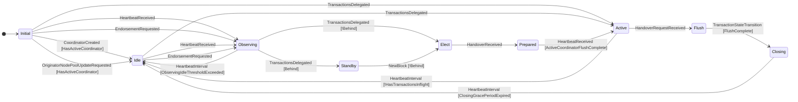
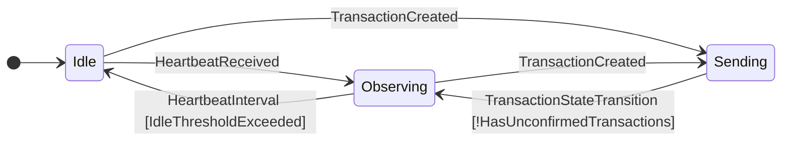
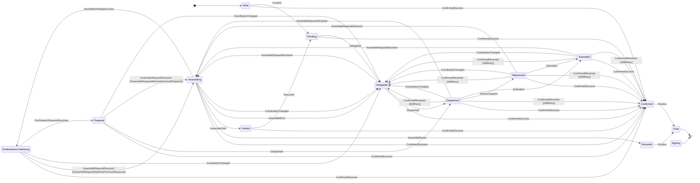

# State machine transition detail

Detailed state diagrams showing every transition event and guard condition for each of the four distributed sequencer state machines.

*Auto-generated from source*

## Coordinator State Machine

### Transition Events

| Event | Description |
| --- | --- |
| **CoordinatorCreated** |  |
| **TransactionsDelegated** |  |
| **HeartbeatReceived** |  |
| **NewBlock** |  |
| **HandoverRequestReceived** |  |
| **HandoverReceived** |  |
| **EndorsementRequested** | Only used to update the state machine with updated information about the active coordinator, out of band of the heartbeats |
| **OriginatorNodePoolUpdateRequested** |  |
| **HeartbeatInterval** | (shared event from sequencer common package) |
| **TransactionStateTransition** | (shared event from sequencer common package) |

---

## Coordinator Transaction State Machine

```mermaid
%%{init: {'themeVariables': {'background': 'transparent'}}}%%
stateDiagram-v2
    direction LR
    state "PreAssembly Blocked" as PreAssembly_Blocked
    state "Endorsement Gathering" as Endorsement_Gathering
    state "Confirming Dispatchable" as Confirming_Dispatchable
    state "Ready For Dispatch" as Ready_For_Dispatch
    [*] --> Initial
    Initial --> Reverted : Delegated [HasRevertedChainedDependency]
    Initial --> Evicted : Delegated [HasEvictedChainedDependency]
    Initial --> PreAssembly_Blocked : Delegated [HasUnassembledDependencies]
    Initial --> Pooled : Delegated [!HasUnassembledDependencies]
    PreAssembly_Blocked --> Pooled : DependencySelectedForAssemble [!HasUnassembledDependencies]
    PreAssembly_Blocked --> Pooled : PreAssembleDependencyTerminated [!HasUnassembledDependencies]
    PreAssembly_Blocked --> Reverted : ChainedDependencyFailed
    PreAssembly_Blocked --> Evicted : ChainedDependencyEvicted
    Pooled --> Assembling : Selected
    Pooled --> PreAssembly_Blocked : DependencyReset [HasUnassembledDependencies]
    Pooled --> PreAssembly_Blocked : DependencyConfirmedReverted [HasUnassembledDependencies]
    Pooled --> Reverted : ChainedDependencyFailed
    Pooled --> Evicted : ChainedDependencyEvicted
    Assembling --> Endorsement_Gathering : Assemble_Success [!AttestationPlanFulfilled]
    Assembling --> Confirming_Dispatchable : Assemble_Success [AttestationPlanFulfilled && !HasDependenciesNotReady]
    Assembling --> Blocked : Assemble_Success [AttestationPlanFulfilled && HasDependenciesNotReady]
    Assembling --> Pooled : StateTimeoutInterval
    Assembling --> Pooled : Assemble_Cancelled
    Assembling --> Reverted : Assemble_Revert_Response
    Assembling --> Pooled : Assemble_Error_Response [CanRetryErroredAssemble]
    Assembling --> Evicted : Assemble_Error_Response [!CanRetryErroredAssemble]
    Assembling --> Final : TransactionUnknownByOriginator
    Assembling --> PreAssembly_Blocked : DependencyReset
    Assembling --> PreAssembly_Blocked : DependencyConfirmedReverted
    Assembling --> Reverted : ChainedDependencyFailed
    Assembling --> Evicted : ChainedDependencyEvicted
    Endorsement_Gathering --> Confirming_Dispatchable : Endorsed [AttestationPlanFulfilled && !HasDependenciesNotReady]
    Endorsement_Gathering --> Blocked : Endorsed [AttestationPlanFulfilled && HasDependenciesNotReady]
    Endorsement_Gathering --> Pooled : EndorsedRejected
    Endorsement_Gathering --> Pooled : StateTimeoutInterval
    Endorsement_Gathering --> PreAssembly_Blocked : DependencyReset [HasUnassembledDependencies]
    Endorsement_Gathering --> Pooled : DependencyReset [!HasUnassembledDependencies]
    Endorsement_Gathering --> PreAssembly_Blocked : DependencyConfirmedReverted [HasUnassembledDependencies]
    Endorsement_Gathering --> Pooled : DependencyConfirmedReverted [!HasUnassembledDependencies]
    Endorsement_Gathering --> Reverted : ChainedDependencyFailed
    Blocked --> Confirming_Dispatchable : DependencyReady [!HasDependenciesNotReady]
    Blocked --> PreAssembly_Blocked : DependencyReset [HasUnassembledDependencies]
    Blocked --> Pooled : DependencyReset [!HasUnassembledDependencies]
    Blocked --> PreAssembly_Blocked : DependencyConfirmedReverted [HasUnassembledDependencies]
    Blocked --> Pooled : DependencyConfirmedReverted [!HasUnassembledDependencies]
    Blocked --> Reverted : ChainedDependencyFailed
    Confirming_Dispatchable --> Ready_For_Dispatch : DispatchRequestApproved
    Confirming_Dispatchable --> Pooled : DispatchRequestRejected
    Confirming_Dispatchable --> Pooled : StateTimeoutInterval
    Confirming_Dispatchable --> PreAssembly_Blocked : DependencyReset [HasUnassembledDependencies]
    Confirming_Dispatchable --> Pooled : DependencyReset [!HasUnassembledDependencies]
    Confirming_Dispatchable --> PreAssembly_Blocked : DependencyConfirmedReverted [HasUnassembledDependencies]
    Confirming_Dispatchable --> Pooled : DependencyConfirmedReverted [!HasUnassembledDependencies]
    Confirming_Dispatchable --> Reverted : ChainedDependencyFailed
    Ready_For_Dispatch --> Dispatched : Dispatched
    Ready_For_Dispatch --> PreAssembly_Blocked : DependencyReset [HasUnassembledDependencies]
    Ready_For_Dispatch --> Pooled : DependencyReset [!HasUnassembledDependencies]
    Ready_For_Dispatch --> PreAssembly_Blocked : DependencyConfirmedReverted [HasUnassembledDependencies]
    Ready_For_Dispatch --> Pooled : DependencyConfirmedReverted [!HasUnassembledDependencies]
    Ready_For_Dispatch --> Reverted : ChainedDependencyFailed
    Dispatched --> Confirmed : ConfirmedSuccess
    Dispatched --> PreAssembly_Blocked : ConfirmedReverted [CanRetryRevert && HasUnassembledDependencies]
    Dispatched --> Pooled : ConfirmedReverted [CanRetryRevert && !HasUnassembledDependencies]
    Dispatched --> Reverted : ConfirmedReverted [!CanRetryRevert]
    Dispatched --> Reverted : ChainedDependencyFailed
    Reverted --> Final : HeartbeatInterval [HasFinalizingGracePeriodPassedSinceStateChange]
    Confirmed --> Final : HeartbeatInterval [HasFinalizingGracePeriodPassedSinceStateChange]
    Final --> [*]
    Evicted --> [*]
```

### Transition Events

| Event | Description |
| --- | --- |
| **Delegated** | Transaction initially received by the coordinator.  Might seem redundant explicitly modeling this as an event rather than putting this logic into the constructor, but it is useful to make the initial state transition rules explicit in the state machine definitions |
| **DependencySelectedForAssemble** | the transaction delegated immediately before the transaction from the same originator has been selected for assembly |
| **Selected** | selected from the pool as the next transaction to be assembled |
| **Assemble_Success** | assemble response received from the originator |
| **Assemble_Revert_Response** | assemble response received from the originator with a revert reason |
| **Assemble_Error_Response** | assemble response received from the originator with an error |
| **Assemble_Cancelled** | the assemble attempt has been cancelled |
| **Endorsed** | endorsement received from one endorser |
| **EndorsedRejected** | endorsement received from one endorser with a revert reason |
| **DependencyReady** | another transaction, for which this transaction has a dependency on, has become ready for dispatch |
| **DependencyReset** | another transaction, for which this transaction has a dependency on, has been reset |
| **DependencyConfirmedReverted** | another transaction, for which this transaction has a dependency on, has been confirmed as reverted |
| **DispatchRequestApproved** | dispatch confirmation received from the originator |
| **DispatchRequestRejected** | dispatch confirmation response received from the originator with a rejection |
| **Dispatched** | dispatched to the public TX manager |
| **ConfirmedSuccess** | confirmation received from the blockchain of a successful transaction |
| **ConfirmedReverted** | confirmation received from the blockchain of a reverted transaction |
| **StateTimeoutInterval** | event emitted when a state has exceeded its maximum allowed duration |
| **TransactionUnknownByOriginator** | originator has reported that it doesn't recognize this transaction |
| **ChainedDependencyFailed** | a chained (same-coordinator) dependency has been permanently finalized as failed |
| **ChainedDependencyEvicted** | a chained (same-coordinator) dependency has been evicted (e.g. assembly failure threshold exceeded) |
| **PreAssembleDependencyTerminated** | the pre-assemble (FIFO ordering) predecessor has reached a terminal state |
| **HeartbeatInterval** | (shared event from sequencer common package) |

---

## Originator State Machine

### Transition Events

| Event | Description |
| --- | --- |
| **HeartbeatReceived** | a heartbeat message was received from the current active coordinator |
| **TransactionCreated** | a new transaction has been created and is ready to be sent to the coordinator TODO maybe name something like Intent created? |
| **HeartbeatInterval** | (shared event from sequencer common package) |
| **TransactionStateTransition** | (shared event from sequencer common package) |

---

## Originator Transaction State Machine

### Transition Events

| Event | Description |
| --- | --- |
| **Created** | Transaction initially received by the originator or has been loaded from the database after a restart / swap-in |
| **ConfirmedSuccess** | confirmation received from the blockchain of base ledge transaction successful completion |
| **ConfirmedReverted** | confirmation received from the blockchain of base ledge transaction failure |
| **Delegated** | transaction has been delegated to a coordinator |
| **AssembleRequestReceived** | coordinator has requested that we assemble the transaction |
| **AssembleAndSignSuccess** | we have successfully assembled the transaction and signing module has signed the assembled transaction |
| **AssembleRevert** | we have failed to assemble the transaction |
| **AssemblePark** | we have parked the transaction |
| **AssembleError** | an unexpected error occurred while trying to assemble the transaction |
| **Dispatched** | coordinator has dispatched the transaction to a public transaction manager |
| **PreDispatchRequestReceived** | coordinator has requested confirmation that the transaction is OK to be dispatched |
| **Resumed** | Received an RPC call to resume a parked transaction |
| **NonceAssigned** | the public transaction manager has assigned a nonce to the transaction |
| **Submitted** | the transaction has been submitted to the blockchain |
| **CoordinatorChanged** | the coordinator has changed |
| **Finalize** | internal event to trigger transition from terminal states (Confirmed/Reverted) to State_Final for cleanup |
