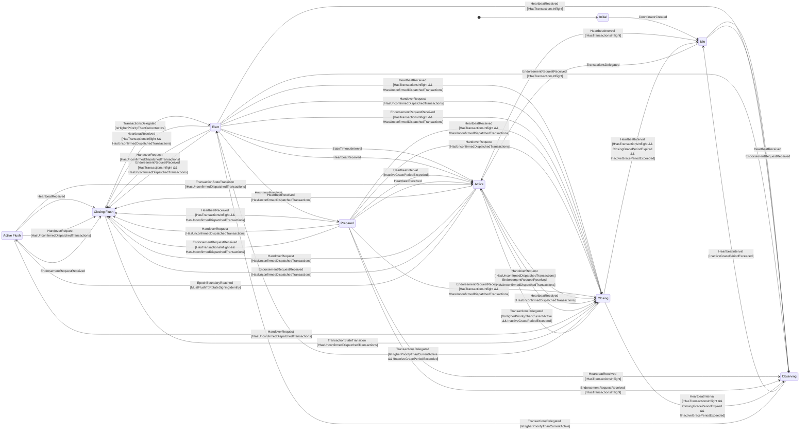
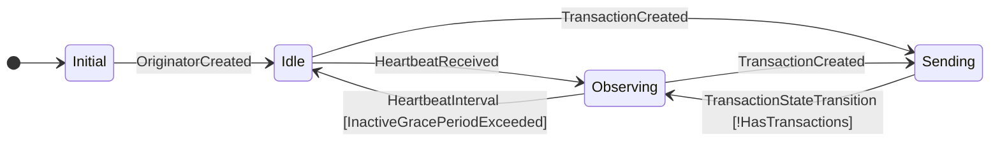
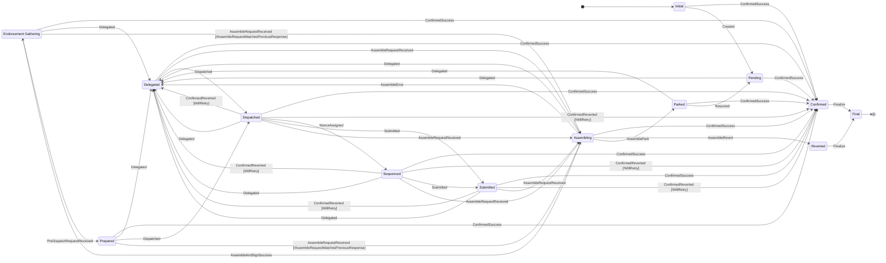

# State machine transition detail

Detailed state diagrams showing every transition event and guard condition for each of the four distributed sequencer state machines.

*Auto-generated from source*

## Coordinator State Machine

### Transition Events

| Event | Description |
| --- | --- |
| **CoordinatorCreated** | |
| **EndorsementRequestReceived** | |
| **EpochBoundaryReached** | |
| **HandoverRequest** | |
| **HeartbeatInterval** | |
| **HeartbeatReceived** | |
| **StateTimeoutInterval** | |
| **TransactionStateTransition** | |
| **TransactionsDelegated** | |

---

## Coordinator Transaction State Machine

```mermaid
%%{init: {'themeVariables': {'background': 'transparent'}}}%%
stateDiagram-v2
    direction LR
    state "PreAssembly Blocked" as PreAssembly_Blocked
    state "Endorsement Gathering" as Endorsement_Gathering
    state "Confirming Dispatchable" as Confirming_Dispatchable
    state "Ready For Dispatch" as Ready_For_Dispatch
    [*] --> Initial
    Initial --> Reverted : Delegated [HasRevertedChainedDependency]
    Initial --> Evicted : Delegated [HasEvictedChainedDependency]
    Initial --> PreAssembly_Blocked : Delegated [HasUnassembledDependencies]
    Initial --> Pooled : Delegated [!HasUnassembledDependencies]
    PreAssembly_Blocked --> Pooled : DependencySelectedForAssemble [!HasUnassembledDependencies]
    PreAssembly_Blocked --> Pooled : PreAssembleDependencyTerminated [!HasUnassembledDependencies]
    PreAssembly_Blocked --> Reverted : ChainedDependencyFailed
    PreAssembly_Blocked --> Evicted : ChainedDependencyEvicted
    Pooled --> Assembling : Selected
    Pooled --> PreAssembly_Blocked : DependencyReset
    Pooled --> PreAssembly_Blocked : DependencyConfirmedReverted
    Pooled --> Reverted : ChainedDependencyFailed
    Pooled --> Evicted : ChainedDependencyEvicted
    Assembling --> Endorsement_Gathering : AssembleSuccess [!AttestationPlanFulfilled]
    Assembling --> Confirming_Dispatchable : AssembleSuccess [AttestationPlanFulfilled && !HasDependenciesNotReady]
    Assembling --> Blocked : AssembleSuccess [AttestationPlanFulfilled && HasDependenciesNotReady]
    Assembling --> Pooled : StateTimeoutInterval
    Assembling --> Pooled : AssembleCancelled
    Assembling --> Reverted : AssembleRevert
    Assembling --> Pooled : AssembleError [CanRetryErroredAssemble]
    Assembling --> Evicted : AssembleError [!CanRetryErroredAssemble]
    Assembling --> Pooled : AssembleRequestRejected
    Assembling --> Evicted : AssembleRequestRejected
    Assembling --> Final : AssembleRequestRejected
    Assembling --> PreAssembly_Blocked : DependencyReset
    Assembling --> PreAssembly_Blocked : DependencyConfirmedReverted
    Assembling --> Reverted : ChainedDependencyFailed
    Assembling --> Evicted : ChainedDependencyEvicted
    Endorsement_Gathering --> Confirming_Dispatchable : Endorsed [AttestationPlanFulfilled && !HasDependenciesNotReady]
    Endorsement_Gathering --> Blocked : Endorsed [AttestationPlanFulfilled && HasDependenciesNotReady]
    Endorsement_Gathering --> Pooled : EndorseRevert [EndorseFailureExceedsTolerance]
    Endorsement_Gathering --> Pooled : EndorseError [EndorseFailureExceedsTolerance]
    Endorsement_Gathering --> Pooled : EndorseRequestRejected [EndorseFailureExceedsTolerance]
    Endorsement_Gathering --> Pooled : StateTimeoutInterval
    Endorsement_Gathering --> PreAssembly_Blocked : DependencyReset
    Endorsement_Gathering --> Pooled : DependencyReset
    Endorsement_Gathering --> PreAssembly_Blocked : DependencyConfirmedReverted
    Endorsement_Gathering --> Pooled : DependencyConfirmedReverted
    Endorsement_Gathering --> Reverted : ChainedDependencyFailed
    Blocked --> Confirming_Dispatchable : DependencyReady [!HasDependenciesNotReady]
    Blocked --> PreAssembly_Blocked : DependencyReset
    Blocked --> Pooled : DependencyReset
    Blocked --> PreAssembly_Blocked : DependencyConfirmedReverted
    Blocked --> Pooled : DependencyConfirmedReverted
    Blocked --> Reverted : ChainedDependencyFailed
    Confirming_Dispatchable --> Ready_For_Dispatch : DispatchRequestApproved
    Confirming_Dispatchable --> Pooled : DispatchRequestRejected
    Confirming_Dispatchable --> Evicted : PreDispatchRequestRejected
    Confirming_Dispatchable --> Final : PreDispatchRequestRejected
    Confirming_Dispatchable --> Pooled : StateTimeoutInterval
    Confirming_Dispatchable --> PreAssembly_Blocked : DependencyReset
    Confirming_Dispatchable --> Pooled : DependencyReset
    Confirming_Dispatchable --> PreAssembly_Blocked : DependencyConfirmedReverted
    Confirming_Dispatchable --> Pooled : DependencyConfirmedReverted
    Confirming_Dispatchable --> Reverted : ChainedDependencyFailed
    Ready_For_Dispatch --> Dispatched : Dispatched
    Ready_For_Dispatch --> PreAssembly_Blocked : DependencyReset
    Ready_For_Dispatch --> Pooled : DependencyReset
    Ready_For_Dispatch --> PreAssembly_Blocked : DependencyConfirmedReverted
    Ready_For_Dispatch --> Pooled : DependencyConfirmedReverted
    Ready_For_Dispatch --> Reverted : ChainedDependencyFailed
    Dispatched --> Confirmed : ConfirmedSuccess
    Dispatched --> PreAssembly_Blocked : ConfirmedReverted [CanRetryRevert && HasUnassembledDependencies]
    Dispatched --> Pooled : ConfirmedReverted [CanRetryRevert && !HasUnassembledDependencies]
    Dispatched --> Reverted : ConfirmedReverted [!CanRetryRevert]
    Dispatched --> Reverted : ChainedDependencyFailed
    Reverted --> Final : HeartbeatInterval [HasFinalizingGracePeriodPassedSinceStateChange]
    Confirmed --> Final : HeartbeatInterval [HasFinalizingGracePeriodPassedSinceStateChange]
    Final --> [*]
    Evicted --> [*]
```

### Transition Events

| Event | Description |
| --- | --- |
| **AssembleCancelled** | |
| **AssembleError** | |
| **AssembleRequestRejected** | |
| **AssembleRevert** | |
| **AssembleSuccess** | |
| **ChainedDependencyEvicted** | |
| **ChainedDependencyFailed** | |
| **ConfirmedReverted** | |
| **ConfirmedSuccess** | |
| **Delegated** | |
| **DependencyConfirmedReverted** | |
| **DependencyReady** | |
| **DependencyReset** | |
| **DependencySelectedForAssemble** | |
| **DispatchRequestApproved** | |
| **DispatchRequestRejected** | |
| **Dispatched** | |
| **EndorseError** | |
| **EndorseRequestRejected** | |
| **EndorseRevert** | |
| **Endorsed** | |
| **HeartbeatInterval** | |
| **PreAssembleDependencyTerminated** | |
| **PreDispatchRequestRejected** | |
| **Selected** | |
| **StateTimeoutInterval** | |

---

## Originator State Machine

### Transition Events

| Event | Description |
| --- | --- |
| **HeartbeatInterval** | |
| **HeartbeatReceived** | |
| **OriginatorCreated** | |
| **TransactionCreated** | |
| **TransactionStateTransition** | |

---

## Originator Transaction State Machine

### Transition Events

| Event | Description |
| --- | --- |
| **AssembleAndSignSuccess** | |
| **AssembleError** | |
| **AssemblePark** | |
| **AssembleRequestReceived** | |
| **AssembleRevert** | |
| **ConfirmedReverted** | |
| **ConfirmedSuccess** | |
| **Created** | |
| **Delegated** | |
| **Dispatched** | |
| **Finalize** | |
| **NonceAssigned** | |
| **PreDispatchRequestReceived** | |
| **Resumed** | |
| **Submitted** | |
