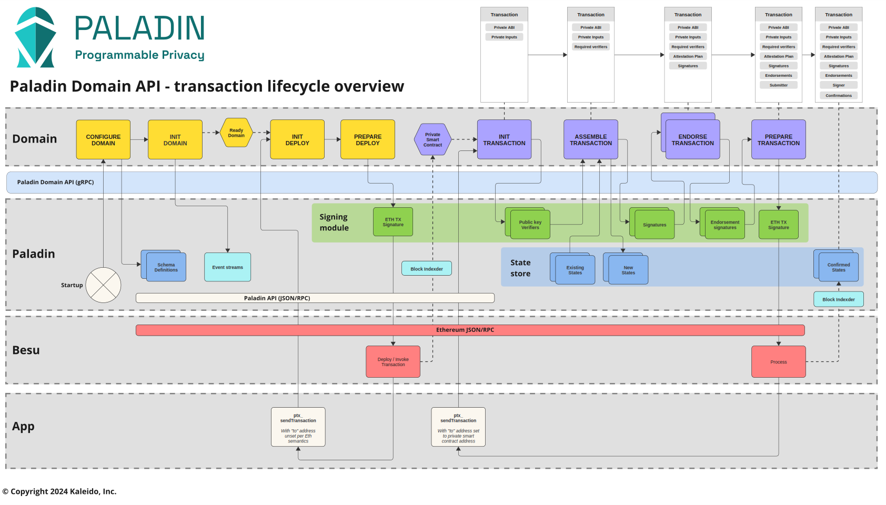

Work in progress page to provide more information on the above workflow.

Please see the detailed comments on the Protobuf definitions in this file in the meantime:

- [To domain](https://github.com/LF-Decentralized-Trust-labs/paladin/blob/main/toolkit/proto/protos/to_domain.proto) - requests from Paladin to a domain
- [From domain](https://github.com/LF-Decentralized-Trust-labs/paladin/blob/main/toolkit/proto/protos/from_domain.proto) - callbacks from a domain to Paladin