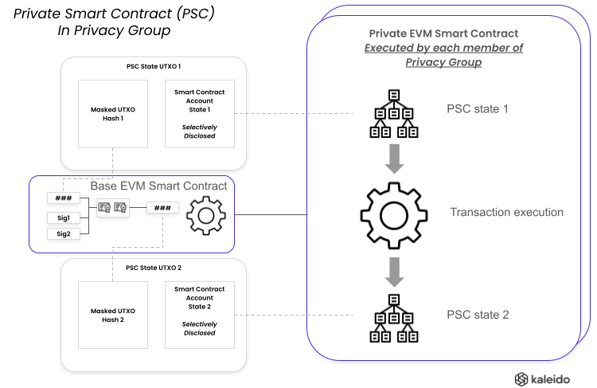
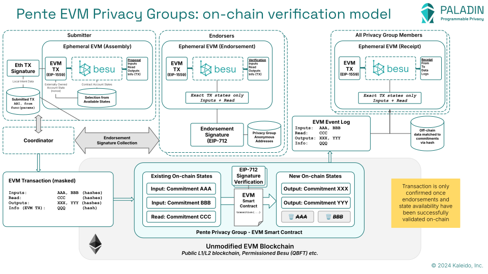

# Pente - Private EVM Smart Contracts

EVM Smart Contracts are built in programming languages like Solidity and Vyper, and execute as code installed into an Ethereum `Account`.

In an EVM base ledger blockchain, there is a single world state that all smart contracts are operating on. All state for all accounts exist in this one global state, at one global version.

The world moves forwards block-by-block.

Pente is a privacy preserving smart contract for Paladin, which provides a different model for _Private EVM Smart Contracts_, where many worlds can exist isolated from each other all validated by the same shared ledger.

Each smart contract is its own world state.



- Private smart contracts exists uniquely within a privacy group
- The transactions are confirmed by spending UTXO states on the base EVM ledger
- The data required for each transition is confidential
- These state transitions can be verified as part of atomic transactions with other tokens

## History of EVM Private Smart Contracts

The concept of Private EVM Smart Contracts is not new.

In Nov 2016 the first implementation was released called [Constellation](https://github.com/Consensys/constellation), attributed to Samer Falah, Patrick Mylund Nielsen and others at JP Morgan Chase.

This combined a modified version of Go-ethereum (as part of the Quorum project) with a Haskell based private transaction manager.

In this model specially identified (though modified `V` values) private transactions were recorded in-line with public transactions in the same blocks, **after** all parties that were included in the private transactions were previously notified of the inputs to those private transactions.

When the block was confirmed by a node which already had the private input data, it would process the private transaction. Other nodes would skip the transaction, assuming they were not a party to it.

This model was evolved through a number of updates over the years, most significantly:

- The re-building of the Constellation (Haskell) private state management runtime in Java:
    - [Orion](https://github.com/consensys/orion): Started in 2019, abandoned in Sep 2021
    - [Tessera](https://github.com/consensys/tessera): Started in 2018, [deprecated in 2024](https://www.lfdecentralizedtrust.org/blog/sunsetting-tessera-and-simplifying-hyperledger-besu)
- Support for private smart contract submission in Hyperledger Besu (additional to Quorum)
    - The modification to the base EVM was reduced, by avoiding modification of the `V` value of transactions, and rather using a special pre-compiled smart contract address
    - A different approach to Private transaction nonce management was adopted in Besu, where a separate nonce is managed in each privacy group
- Quorum added "Private state validation" (not supported in Besu)
    - Provides a validation mode that helps ensure that all transactions for a given private smart contract are always sent to the same participants

However, the model has not fundamentally changed in this time.

Read here about the [Private transaction lifecycle](https://docs.goquorum.consensys.io/concepts/privacy/private-transaction-lifecycle) for Quorum and Besu when used with the Tessera private transaction manager.

### Problems with the existing model

There are two closely related problems with the EVM Private Smart Contract model as implemented in these generations of the technology.

1. When used correctly, state is locked inside of a Private Smart Contract
    - This is fundamental to the programming model of EVM. A Smart Contract holds a single and complete set of state, visible to all parties in the privacy group.
    - Transacting across smart contracts is problematic
    - Implementing something like an ERC-20/ERC-721 token does not make sense in many scenarios, as the token can never be traded outside of the privacy group (noting that private positions modelled with ERC-20 tokens are a good exception to this statement)
2. The system does not provide feedback when this model is broken, intentionally, or via an operational/system error
    - Because _only the inputs_ are recorded to the blockchain for each transaction, via hash, and private smart contracts share a global address space, it is possible to have multiple overlapping sets of privacy groups transacting against the same smart contract
    - This means **the states diverge** so there is no single source of truth of the state of the private smart contract. Different parties have different data. So the fundamental assurances of a Smart Contract of agreed computation are not net.
    - The "Private state validation" feature (Quorum only) was a step towards solving this issue, by preventing mis-use of private smart contracts across different privacy groups.
    - Read more about these challenges [here](https://www.kaleido.io/blockchain-blog/why-tokens-dont-work-using-private-transactions)

## Paladin privacy groups

The Pente domain uses the state management engine of Paladin to improve upon the existing model.

Pre-submission endorsement of the full transaction execution is performed, combined with on-chain signature verification of the commitments to the input and output states, and double-spend protection on the account states enforced on-chain.



### On-chain state verification

The guiding principals are:

- On-chain transactions on the base EVM are the source of truth
    - Every transaction execution is enforced **on-chain**, via threshold signature verification
    - Pre-verification / endorsement of transactions happens off-chain prior to submission
    - The exact signed transaction, inputs and outputs, are verified & signed by endorsers
    - The transaction and execution result are masked as `commitments` on-chain
        - Salted hashes of the signed input transaction, and input/output/read account states
- No modification to the base EVM
    - No `V` value changes
    - No special execution during block execution / confirmation
    - The base EVM ledger transaction is a pure EVM transaction
- Each privacy group is a unique EVM smart contact on the base ledger
    - Private Smart Contract exists entirely within a privacy group
    - A privacy group is just like a mini-blockchain, hosted inside of one smart contract
- Submitter account and nonce management is managed within each privacy group
    - Accounts are UTXO states stored in this contract
        - Externally owned accounts (EOAs)
        - Contract accounts
    - State/code/nonce transitions are all deterministic
    - Endorsements of exact transitions are verified on-chain via EIP-712 signatures
- Besu EVMs are used to pre-execute EVM transactions
    - Just the EVM is loaded as a Java code module, on-demand when required
    - These "ephemeral EVMs" are executed in the Paladin runtime
        - There is no requirement for a local Besu runtime co-located with Paladin
    - State is managed via the UTXO state storage of Paladin
        - No use is made of the Bonsai/Forrest state store of Besu
- Private Smart Contract transactions are atomically interoperable via the Paladin framework
    - This is the single most important enhancement. Because Pente is just another privacy preserving smart contract in Paladin, it can atomically interoperate with Token smart contracts. 
    - See the [Atomic Interop](./atomic_interop.md) section for how this enables sophisticated DvP scenarios to be programmed via Private EVM

## Private ABI

The private ABI of Pente is implemented in [Java](https://github.com/LF-Decentralized-Trust-labs/paladin/tree/main/domains/pente),
and can be accessed by calling `ptx_sendTransaction` with `"type": "private"`.

### constructor

Creates a new Pente private EVM group, with a new address on the base ledger.

```json
{
    "name": "",
    "type": "constructor",
    "inputs": [
        {"name": "group", "type": "tuple", "components": [
            {"name": "salt", "type": "bytes32"},
            {"name": "members", "type": "string[]"}
        ]},
        {"name": "evmVersion", "type": "string"},
        {"name": "endorsementType", "type": "string"},
        {"name": "externalCallsEnabled", "type": "boolean"},
    ]
}
```

Inputs:

* **group** - group details, including member lookup strings and a randomly-chosen group salt
* **evmVersion** - EVM version to run (such as "shanghai", "paris", "london")
* **endorsementType** - only supported type is "group_scoped_identities" (100% endorsement on each transaction from all group members)
* **externalCallsEnabled** - true to allow this privacy group to trigger external calls to other contracts on the base ledger

### deploy

Deploys a new contract into the private EVM group.

```json
{
    "name": "deploy",
    "type": "function",
    "inputs": [
        {"name": "group", "type": "tuple", "components": [
            {"name": "salt", "type": "bytes32"},
            {"name": "members", "type": "string[]"}
        ]},
        {"name": "bytecode", "type": "bytes"},
        {"name": "inputs", "type": "tuple", "components": [
            // variable - see below
        ]}
    ]
}
```

Inputs:

* **group** - group details, including member lookup strings and a randomly-chosen group salt (must exactly match what was passed at group creation)
* **bytecode** - the compiled contract bytecode
* **inputs** - ABI constructor parameters for the contract (must be filled in to match the contract being deployed)

### invoke

Send an encoded transaction to a private smart contract.

```json
{
    "name": "invoke",
    "type": "function",
    "inputs": [
        {"name": "group", "type": "tuple", "components": [
            {"name": "salt", "type": "bytes32"},
            {"name": "members", "type": "string[]"}
        ]},
        {"name": "to", "type": "address"},
        {"name": "data", "type": "bytes"}
    ]
}
```

Inputs:

* **group** - group details, including member lookup strings and a randomly-chosen group salt (must exactly match what was passed at group creation)
* **to** - the address of the private contract
* **data** - an encoded transation (like the `data` of `eth_sendTransaction`)

### &lt;custom function&gt;

Perform an invoke or call to any function in a private smart contract.

```json
{
    "name": "<variable - see below>"
    "type": "function",
    "inputs": [
        {"name": "group", "type": "tuple", "components": [
            {"name": "salt", "type": "bytes32"},
            {"name": "members", "type": "string[]"}
        ]},
        {"name": "to", "type": "address"},
        {"name": "inputs", "type": "tuple", "components": [
            // variable - see below
        ]}
    ]
    {"name": "outputs", "type": "tuple", "components": [
        // variable - see below
    ]}
}
```

Inputs:

* **group** - group details, including member lookup strings and a randomly-chosen group salt (must exactly match what was passed at group creation)
* **to** - the address of the private contract
* **inputs** - ABI method inputs for the contract (must be filled in to match the contract)

Other fields:

* **name** - name of the method to invoke on the contract.
* **outputs** - ABI method outputs for the contract (only valid for `ptx_call`, must be filled in to match the contract).

## Public ABI

The public ABI of Pente is implemented in Solidity by [PentePrivacyGroup.sol](../../../solidity/contracts/domains/pente/PentePrivacyGroup.sol),
and can be accessed by calling `ptx_sendTransaction` with `"type": "public"`. However, it is not often required
to invoke the public ABI directly.

### transition

Transition the world state of this privacy group.
Generally should not be called directly.

```json
{
    "name": "transition",
    "type": "function",
    "inputs": [
        {"name": "txId", "type": "bytes32"},
        {"name": "states", "type": "tuple", "components": [
            {"name": "inputs", "type": "bytes32[]"},
            {"name": "reads", "type": "bytes32[]"},
            {"name": "outputs", "type": "bytes32[]"},
            {"name": "info", "type": "bytes32[]"}
        ]},
        {"name": "externalCalls", "type": "tuple[]", "components": [
            {"name": "contractAddress", "type": "address"},
            {"name": "encodedCall", "type": "bytes"}
        ]},
        {"name": "signatures", "type": "bytes[]"}
    ]
}
```

Inputs:

* **txId** - Paladin transaction identifier
* **states** - list of states (input states will be spent, output states will be created, read states will be verified to exist, and info states will not be checked)
* **externalCalls** - list of encoded EVM calls against other external contracts, which will be executed as a side-effect of the transition
* **signatures** - EIP-712 signatures from all parties in the privacy group to validate the state transition

### approveTransition

Approve a specific `transition` transaction to be executed by a specific `delegate` address.
Generally should not be called directly.

```json
{
    "name": "approveTransition",
    "type": "function",
    "inputs": [
        {"name": "txId", "type": "bytes32"},
        {"name": "delegate", "type": "address"},
        {"name": "transitionHash", "type": "bytes32"},
        {"name": "signatures", "type": "bytes[]"}
    ]
}
```

Inputs:

* **txId** - Paladin transaction identifier
* **delegate** - address of the delegate party that will be able to execute this transaction once approved
* **transitionHash** - EIP-712 hash of the intended transition, using types `Transition(bytes32[] inputs,bytes32[] reads,bytes32[] outputs,bytes32[] info,ExternalCall[] externalCalls)` and `ExternalCall(address contractAddress,bytes encodedCall)`
* **signatures** - EIP-712 signatures from all parties in the privacy group to validate the state transition

### transitionWithApproval

Execute a transition that was previously approved.

The values of `states` and `externalCalls` will be used to (re-)compute a `transitionHash`, which must exactly
match a `transitionHash` that was previously delegated to the sender via `approveTransition`.

```json
{
    "name": "transitionWithApproval",
    "type": "function",
    "inputs": [
        {"name": "txId", "type": "bytes32"},
        {"name": "states", "type": "tuple", "components": [
            {"name": "inputs", "type": "bytes32[]"},
            {"name": "reads", "type": "bytes32[]"},
            {"name": "outputs", "type": "bytes32[]"},
            {"name": "info", "type": "bytes32[]"}
        ]},
        {"name": "externalCalls", "type": "tuple[]", "components": [
            {"name": "contractAddress", "type": "address"},
            {"name": "encodedCall", "type": "bytes"}
        ]},
      ]
}
```

Inputs:

* **txId** - Paladin transaction identifier
* **states** - list of states (input states will be spent, output states will be created, read states will be verified to exist, and info states will not be checked)
* **externalCalls** - list of encoded EVM calls against other external contracts, which will be executed as a side-effect of the transition
