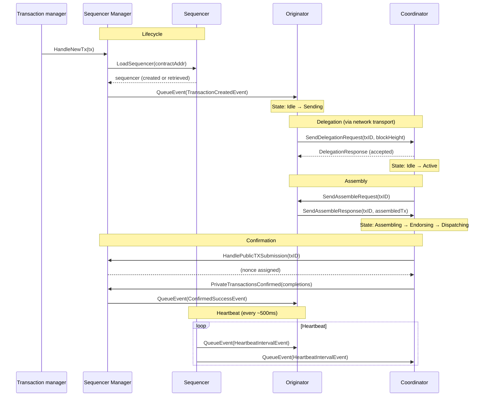

# Sequencer Component Relationships

The distributed sequencer is composed of four main components. Each private contract address gets its own **Sequencer**, which owns one **Originator** and one **Coordinator** instance.

