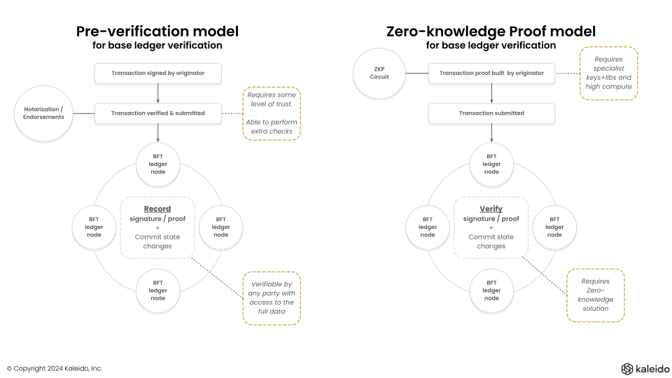
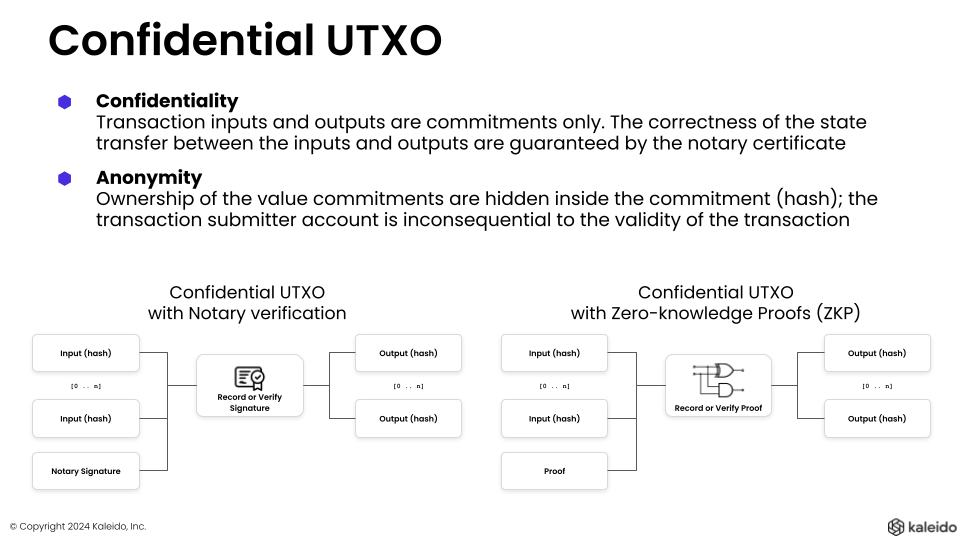

There are two fundamental approaches to preserving privacy of participants in a token ecosystem, while ensuring that all parties can **trust a token they receive**.

## Issuer-backed / pre-verification

Some amount of trust must be given to the one-or-more parties that can verify a transaction is valid, and attest to that verification.

- A signed attestation is provided by this party that they validated the transaction
- The attestation includes that authorization was provided by the sender, with a signature
- The working of this party can be checked by anyone who has access to the unmasked data
- The ledger _cannot validate the data_
- The ledger can perform double-spend protection of the token/value/states

This mode of operation is very efficient in its use of the ledger, as it only requires minimal data to be written that allows verification of the transaction off-chain, and double-spend protection on-chain.

Trust in a token received, is based on trust of the issuer/pre-verifier, as you are trusting not only that the current transaction you received the data for is valid, but that all previous transactions that could affect the uniqueness/value of your token are also valid.

### Potential challenges with issuer-backed model

1. Centralization of data/trust
    - This is sometimes considered a significant benefit, rather than a challenge. Particularly if a party is required legally to maintain a record of every transaction. As regardless of the technology there is some centralization of trust in that party.
    - Note that with Paladin it is possible for a pre-verification model to atomically interoperate with Private EVM state, and ZKP backed tokens in a single transaction. So trusting an issue for one token, does not mean they need to have access to all business data in a transaction
2. Operational coupling
    - Availability to transact, is based on availability of the pre-verifier infrastructure. Again this is sometimes considered a benefit, if the pre-verifier has a role that includes preventing transactions completing that do not conform to certain rules only it can enforce.

## Zero-knowledge proofs (ZKP)

The alternative approach is to use a ZKP circuit to cryptographically verify the business transaction conformed to the rules of the smart contract.

This use of advanced cryptography has the following benefits:
- Fully decentralized - any party can generate a proof, and submit a transaction, as long as that transaction meets the rules of the contract
- Full enforcement on-chain - any transaction that does not conform is rejected directly via the base ledger

### Paladin and Zeto

Paladin has a sibling project [zeto](https://github.com/hyperledger-labs/zeto), which contains a set of ZKP written in Circom and has been undergoing peer review for some time before the availability of Paladin itself.

The following features are part of the Zeto project, and Paladin provides the client for these.

### Fungible tokens

Coin selection, proof generation and transfer of coins containing an owner and a numeric value.

### Non-fungible tokens

Uniqueness of an identifiable token within a smart contract, and the transfer of ownership of that token.

### Off-chain encrypted data transfer

The separation of the data from the proof submitted on-chain, requiring separate encrypted transfer (provided by Paladin) of the states.

> Off-chain transfer avoids the need to write data with a static encryption key immutably to a chain. A detailed discussion of protection of counter-party risk in DvP scenarios from non-disclosure of data using Pente Private EVM privacy groups is being prepared at the time of writing of this introduction.

### On-chain encryption of data

Options using on-chain encryption are also provided.

### Nullifiers for additional anonymity

Nullifiers mask the spending of a coin in a way that only the spender knows which coin was spent - providing increased levels of anonymity.

Paladin supports the use coordination required for generation of nullifiers for states by the owners of those states, as an advanced wallet and distributed state management function.

### Snark friendly encryption and hashing

Babyjubjub encryption and Poseidon hashing is used.

> See the Key Management section of the Paladin architecture docs for details of how key materials are made available to the Zeto engine for use in nullifier and proof generation.

### WebAssembly execution environment for proof generation

Paladin supports multiple different execution environments for components, all in a single process through its runtime architecture.

Zeto uses this to run high performance execution of Circom compiled circuits.

### Governance requirements

The fully decentralized nature of a ZKP based solution can be a challenge for enterprise use cases, where KYC/AML checks might be required on trading participants, or other governance activities might be required that cannot be modelled directly in a ZKP circuit.

Zeto provides an implementation of a ZKP backed KYC registry on-chain, requiring every transaction to come with a proof that the sender and receiver public keys are included in the on-chain registry.

Zeto also demonstrates how a token can use a mixture of fully ZKP based logic, and issuer-backed logic for different functions. For example requiring specific authority to perform a `mint` operation, while allowing `transfer` operations to be fully decentralized.

## UTXO based state model

Paladin is an EVM native solution, using EVM smart contracts to back each of the types of private smart contract provided.

Often EVM smart contracts are assumed to implement an account model for management of states, because the open standards on Etherum like ERC-20, ERC-721 are all based on an account model.

However, the majority of privacy preserving projects that build on top of EVM utilize a UTXO model for state management because of the nature of the problem being solved.

### Unspent Transaction Outputs

In a UTXO model:

- State is never modified - only read, consumed, or produced
- Each state is self-consistent - making it more likely to be usable in isolation of other states

These properties make a UTXO model a great fit for performing _atomic operations_ in a privacy preserving environment.

As such all of the tokens, and the Private EVM Privacy Groups, in Paladin are based on a UTXO state storage and distribution system, with confidentiality built in based on selectively disclosing those states only to those parties with a right to have access to them.

