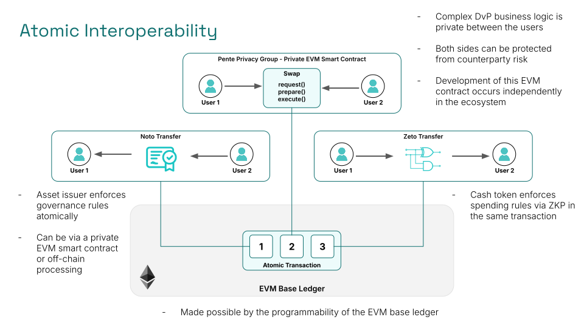

One of the questions asked about the Paladin project is "Why EVM?"

We've discussed that a lot of technologies used in Paladin add layers of state management and advanced cryptography that diverge from the traditional programming paradigms of ERC-20 and ERC-721 contracts.

Is it "just" the vibrancy of the EVM developer community and ecosystem? Or is there something unique about the programmable nature of the EVM ledger itself that is transformational in the solution, compared to using a bespoke DLT at the base?

## The power of the EVM sandwich

Let's zoom out an look at a use case, and see how it's made possible by the fact that there is a fully programmable EVM at both the bottom (fully open and decentralized) end, and the top (fully private and isolated) ends of the stack.

In the diagram above, we see the use of three different technologies, developed independently by three different sets of developers working atomically together:

1. An issuer-backed asset being transferred from User1 to User2
    - For example a bond or other regulated security
2. A fully decentralized ZKP-backed cash token being transferred from User2 to User1
    - For example some CBDC coins
3. An arbitrarily complex multi-step piece of logic being executed between User1 and User2
    - For example a DvP flow agreeing and settling a trade

Each of these three smart contracts is backed by an on-chain EVM smart contract on the base ledger. As a result, the EVM can be used to orchestrate a _single atomic transaction_ across all three contracts.

## Ecosystem programmability

Even more important than the fact this atomicity is possible, is the fact that the development of the use case was decentralized in nature.

- The asset issuer built and issued their token
    - The did not need to know the private details of the trade
    - They still ensured the rules of their token were obeyed 
- The cash issuer built their currency
    - They were not even involved in the trade - the ZKP enforced trading rules via proof
- The users used a smart contract to settle their trade
    - Likely supported by an EVM innovator in the ecosystem

This ecosystem programmability is the true power of EVM, and the recipe for its success in fostering adoption of Web3 in the public community.

## Where's the catch?

As with any Web3 swap, there are a couple of important pre-requisites to make this possible:

- Standard interfaces that support programmability
    - The ability to obtain a pre-approval for a transaction from a notary
    - The ability to lock a proof for conditional execution
    - The ability to trigger a base ledger transaction from an EVM Privacy Group
- Multiple transactions are required to setup the trade for execution
    - True for most atomic swap operations in practice
    - Does not change the fact the final execution is a single atomic transaction

