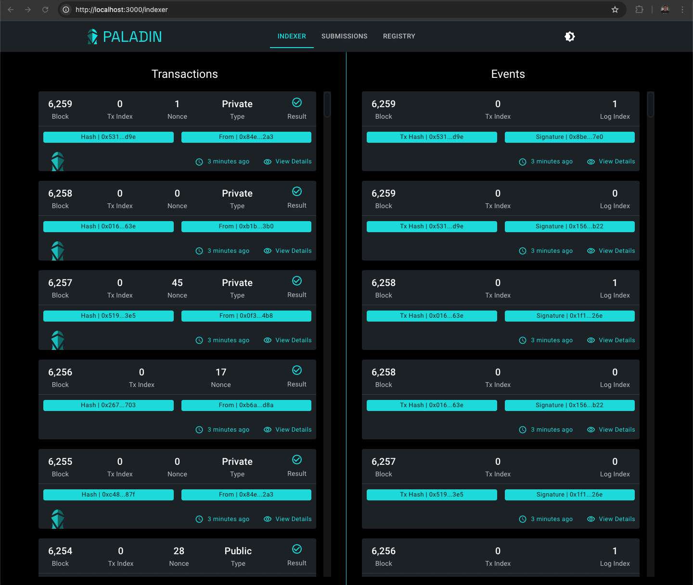

More than “toolkit” or “framework”, Paladin is a fully functioning client for enterprise adoption of EVM with privacy.

## API

From submission of transactions, through to reliably detecting events, the Paladin client provides a full service API that is simple and consumable for EVM developers.

- The methods are all available and documented using JSON/RPC over HTTP and WebSockets
- The input/output types are modelled using the Ethereum standards (inc. ABI type)
- The data is mapped to/from JSON for you without needing complex encoding
- Transactions are looked after reliably until they are complete
- Signing and wallet functions are integrated into the runtime
- Client bindings and type definitions for popular dev languages (Typescript, Java, Golang)

## Embedded UI

- Quick access to transactions, block indexing, registry and more.
- Private EVM transaction decoding and visibility.

## Transaction engine

Event-driven engine for managing transactions through from submission to on-chain confirmation, with three major components.

### Public transaction manager

Latest generation, high performance, reliable submission engine for streaming transactions to the base ledger.

Works for any EVM smart contract, not just privacy preserving smart contracts.

- ABI error decoding
- Full nonce management using a reliable database
- Confirmation and gas management for public chains
- Integrated with the signing engine
- Fully asynchronous and event driven engine, for maximum throughput

### Private transaction manager

The event-driven orchestration engine required to coordinate and submit privacy preserving transactions to the chain.

- Integrating multiple domains of privacy over an extensible pluggable interface
- Coordinating across nodes to gather the signatures and endorsements required to submit private transactions at scale
- Handling graphs of dependencies between UTXO input and output states, ahead of confirmation in blocks on-chain
- Reliably distributing new states to recipients of transaction outputs

### Common management

Unified experience and orchestration across public and private transaction managers.

- Chaining private transaction assembly to the corresponding submission of a base ledger transaction
- Managing receipts, and rich query of current and historical transactions
- Storing prepared transactions, for use in atomic swap operations

## Blockchain indexer

High performance indexer for a sparse view of the entire chain, combined with reliable event streams used internally by domains and available for external subscription to EVM events.

- Blocks, Transactions and Event signatures for every transaction by default
- Confirmation management to only detect finalized events
- Reliable event streams with checkpoints for in-order delivery of events, including historical replay

## Key Management

Enterprise optimized key management system built into the Paladin runtime, with remote signing module support.

- Key aliases and address book function, supporting rich multi-wallet folder based organization
- ZKP prover integration for in-memory assembly of proofs with signing keys
- HD Wallet derivation for high volume single use keys for anonymity
- 1:1 static key mapping, master-key encryption and in-HSM signing for high value keys
- Pluggable key storage for integration of HSM/SSM solutions
- Remote-capable signing module for deployment separation of runtime and signing engines

> See [Architecture docs](../architecture/key_management.md) for more detail

## Private state store

A critical component for wallet functions in a privacy preserving client, as private states are not guaranteed to be recoverable by another party. Once lost, data (and value) might be lost forever.

- In-memory assembly of states for chains of transactions ahead of submission
- Schema based modelling of states for different privacy domains, including indexing and ABI data types
- Rich query interface with JSON syntax, and SDK clients
- Confirmation management for states coupled to domain-specific transaction indexing
- Nullifier support for fully anonymous ZKP domains

> See [Architecture docs](../architecture/state_store.md) for more detail

## Node registry

Secure connectivity information for nodes must be managed in a private environment, and Paladin provides a pluggable registry with an event-driven EVM Smart backed implementation out of the box.

- Event-driven indexing model, extensible beyond just blockchain registries
- Multiple registries supported per Paladin node runtime, allowing overlapping private connectivity networks
- Rich query interface - supporting complex address book function, as well as node connectivity
- Manages off-chain transport connectivity endpoints, including transport specific security credentials
- Natively decentralized model allows private connectivity networks to build quickly and grow

## Private Data Transports

Connectivity between nodes for the transfer of private states is a core requirement for any privacy preserving solution.

- Code-pluggable transports
- MTLS direct HTTPS (gRPC) connectivity out of the box
- Extensible to hub+spoke models such as JMS clients (pure Java capable)

## Pluggable privacy domains

Each of the token implementations, and the Private EVM implementation, confirm to a single lifecycle model for the assembly, coordination and submission of transactions through the private transaction lifecycle.

> See [Architecture docs](../architecture/domains.md) for more detail.