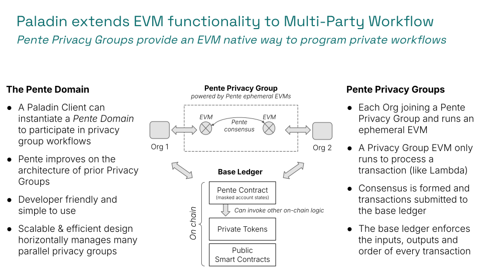

EVM smart contracts are established as the most popular programming model for writing digitally enforceable business logic.

Almost every business transaction has some workflow involved, and as such being able to digitally enforce this workflow through EVM programmed logic is a critical part of designing an enterprise use case that gets value from Web3 technologies.

## EVM programming model in a nutshell

The EVM programming model is easy to understand conceptually, and there are great samples and expertise out there to build upon.

- Accounts can hold data, and participate in transactions
- Smart contracts are a special type of Account that has code
- Smart contracts expose functions that can be called by other accounts
- Smart contract functions update the data inside of the smart contact account
- Smart contracts can call other smart contracts
- A transaction is an atomic operation that updates one or more account

This fantastic simplicity that is the greatest power of EVM, is also a challenge - it results a _single world state_ across all accounts on a ledger.

In use cases with privacy requirements, there are lots of different groups of parties, who all have access to different sets of data.

## One approach - lots of isolated chains

Creating lots of individual and isolated ledgers/blockchains for all those different groups is a very cumbersome activity (much experimentation has been done in earlier generations of ledger technologies on this approach).

The biggest challenge with creating all those separate chains, is that you lose the ability to transact across them atomically. Complex escrow-based transactions (3rd party or time lock based) are required to transact across them, because fully atomic transactions cannot be performed.

> Note that the Paladin project does not assume that there will be "one chain to rule them all". A diversity of permissioned and public blockchains is an absolute reality, for scale, risk, jurisdictional integrity and many other reasons. The EVM ecosystems is inherently a multi-chain ecosystem. However, the ability to atomically transact between parties within a _within a single chain_ is still necessary in practice for truly atomic transactions. This means some amount of sub-ledger privacy is always going to be necessary regardless of the number of chains that exist for Web3 to deliver the settlement finality it promises.

## Privacy groups

The concept of a EVM privacy group is a powerful lighter weight approach that separates the two responsibilities:

1. The private "world state" associated with a set of private smart contracts
    - This is held only by those participating in the privacy group
2. The ledger that enforces the transitions of that private world state
    - This ledger is shared across many privacy groups, and public EVM transactions

By creating this separation, you can have as many privacy groups sharing a single ledger as you require.

## Challenges with previous generations of the technology

There are some key challenges that existed with previous generations of EVM privacy groups, that are addressed by the `Pente` implementation provided with Paladin:

1. Ability for state divergence, due to lack of enforcement on the base ledger
    - Previous generations only wrote to the based ledger the _inputs_ to transactions. This meant that the state had the potential to diverge between parties in the privacy group. Resulting in a stall in processing (bad) or diverged processing against different state (worse).
2. Inability to cause actions atomically across privacy groups and public EVM
    - Privacy groups have been well established for performing private transactions with a defined beginning, middle and end, with a defined set of parties. However, complex use cases as described in the [Privacy Preserving Tokens](./tokens) section require workflows that use the inputs/outputs from one transaction as part of another transaction. Historically this has been impossible.
3. Modification of the base EVM ledger client
    - All previous generations of the technology required some modification of the base ledger technology itself. A special client that contained logic to coordinate the private transactions in the privacy group, with the block formation on the main ledger. As well as limiting the reach of the technology to permissioned ledgers, this has proven problematic for ongoing maintenance.

## Pente feature summary

The Pente implementation of privacy groups provided with Paladin addresses all three of these challenges.

### Off-chain endorsement backed by on-chain enforcement

The flow in Pente to form each transaction is summarized as follows:

- The sender of the transaction prepares it
    - Signing the input payload
    - Proposing the existing account states that will be read/updated
    - Proposing the new account states that will be produced
- Consensus is formed through endorsement signatures
    - Members of privacy group re-execute the signed transaction
    - The same exact account states are used by every member who endorses
    - A signature is only provided if the execution results are identical to the proposal
- The base ledger enforces the transition
    - A masked record of every account state is held on-chain
    - All account states that are modified/read in a transaction must exist
    - Once executed, no other transaction can use any modified account state
    > - This is a derivation of a UTXO model, where each account state is a UTXO

In order to support multiple transactions per block, the Paladin engine performs consensus election of a coordinator that coordinates the preparation (or "assembly") of a graph of transactions.

### Atomic actions on the base ledger as endorsed side-effects

Each Pente privacy group, is backed by a unique smart contract on-chain. This means it has a unique contract identity on the base ledger, that can be authorized as an account against other smart contracts.

Within the private EVM, a special event can be emitted that each endorsing party will validate to convert into a deterministically constructed function call payload on the base ledger. When the transaction is confirmed by the blockchain, this action will be performed atomically as part of that transaction.

Thus an agreed smart contract transaction inside the private EVM, can be coordinated to have an atomic side effect outside of the private EVM.

This is a very powerful feature of the Pente privacy group technology that allows some key use cases including:

- Using a private EVM smart contract as the notary function for a notarized token
- Coordinating the result of a DvP/PvP or other settlement activity inside of a smart contract, with another smart contract
    - For example settling a leg of a private transaction with a public ERC-20 token transfer

### Run on any EVM base ledger, with ephemeral Besu EVM instances

Pente is purely "app layer" technology from the perspective of the base ledger. No special functions are required - the EVM smart contract that backs the privacy group is completely normal EVM logic.

Pente then operates by creating Besu EVM instances on-demand whenever a transaction requires one, running inside the Paladin engine (separate to the blockchain node).

The account states that are needed to run the transaction are loaded on-demand as the transaction executes inside of the EVM, in order to prepare the transactions. The exact states that were loaded are recorded, and using a hash-based identifier that is based on the full account state at the time of execution.

Then when endorsing the transaction, exactly those same account states are pre-loaded into the on-demand created EVM for endorsement - so no other data can be read during endorsement, that was not declared when preparing the transaction.

Generating a receipt containing all the events from a transaction, or performing a `call` operation, work in similar ways to the above - hot loading an EVM in just to perform that one task.

This approach allows for a huge scale of number of separate EVM privacy groups, each with a complete and independent "world state". These privacy groups might be extremely short lived, only spanning an individual business transaction. Or they might be long lived, but limited in their privacy scope - such as maintaining the private issuer state of an issuance of assets.
