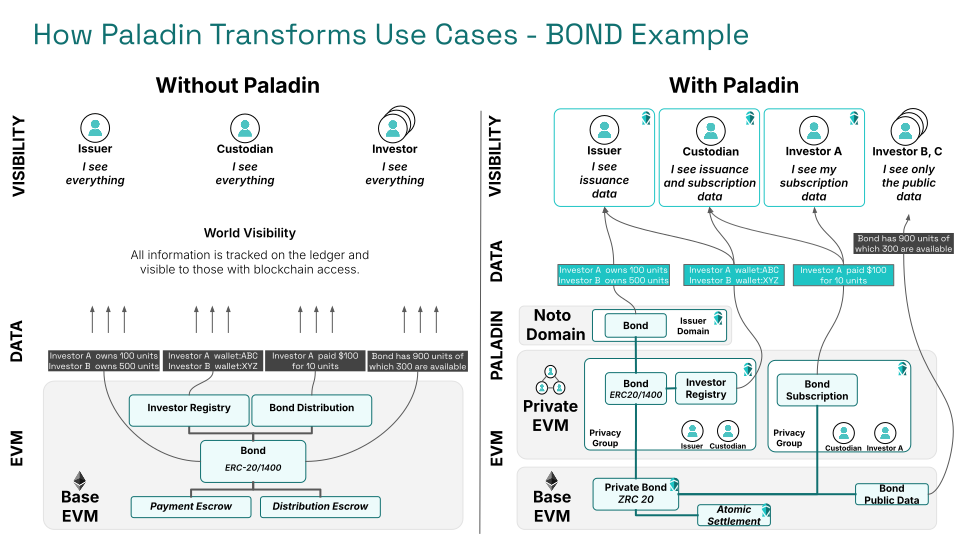

Tokens are the foundation on which blockchain and DLT use cases are built.

A token is a digital record of the existence and ownership of something of value.

The ability to refer to and transfer ownership of a token as part of an _atomic transaction_, is what makes Web3 (Blockchain and DLT) technologies fundamentally different to the API driven world of Web2.

## Tokens standards on EVM

EVM has established really important standards for interoperability of tokens.

- ERC-20 and related standards like ERC-777
    - These provide an interoperability standard for `fungible` tokens, where value is divisible and interchangeable within the pool of value represented by the token
- ERC-721 and related standards like ERC-1155
    - These provide an interoperability standard for `non-fungible` tokens, representing a unique item with a unique identity
    - In the case of ERC-1155 the ability to blur the lines between fungible and non-fungible use cases
- ERC-1400 (ERC-14xx), ERC-3643 (T-Rex) and related standards
    - These provide various levels of reference and standardization for the more complex realities of business use cases
    - Implementors might use these as an accelerator for building real-world enterprise uses cases using tokens, although none provide a one-size-fits-all solution
    - Generally tokens still conform to ERC-20/ERC-721/ERC-1155 when encompassing more complex standards, as that is where the most interoperability and programmability comes from

> None of these standards address privacy, because these tokens requires complete visibility into the transaction history to trust the value.

## The privacy requirements

To build enterprise use cases meaningfully that use tokens, the data must be segregated in a way that allows each party to see and be in control of an appropriate subset of data in the transaction.

### The token itself

The token itself needs to have a wide reach, to be a provably unique record of ownership across the whole ledger/blockchain. This is what makes a token so powerful.

In a privacy preserving use case, it is necessary to avoid the history of ownership of a token being directly or indirectly available to those with access to the chain. However, it must still be true that when I receive a token that I can trust the legitimacy of the token within the scope of the ledger.

As such the existing open models of ERC-20 and ERC-721 derived standards to not fit a privacy preserving use cases, as these tokens require access to the token account state to validate the token, and this account state is a product of all previous transactions that occurred for that token. So I need complete historical visibility to trust the authenticity of any token I receive.

Alternative approaches described below using issuer-private data, or zero-knowledge proofs, are required to protect the confidentiality and anonymity of the parties transacting. These approaches are of course not new to EVM, but they do not currently have the same standardization, programmability or interoperability of ERC-20 / ERC-721, and that is something the Paladin project aims to address.

### Token and token holder data

There are often strong anonymity requirements that mean participants in the ecosystem cannot directly know, or indirectly infer through inspecting transaction patterns, who owns a token at any given point in time.

Conversely, it is necessary for the holder of a token to be able to prove information about the token, and ownership of that token, when required to complete a transaction.

The issuer of a token might need to hold data about every holder of a token, and prove they have performed KYC/AML checks against it. This data is usually subject to legal requirements on its retention, including the ability to delete it.

### Transaction scoped data

Data placed directly on a base ledger is immutable, and visible to all. Whereas the data involved in a transaction between parties is often scoped only to the execution of that one business transaction. There might be many steps involved, and those steps need to be enforced through a smart contact.

This transaction scoped data is commonly also not allowed to be disclosed to the issuers of the tokens that are being exchanged.

## The Paladin approach

Paladin is designed to combine technologies, allowing the partitioning of data to those with a right to have access to it, while allowing atomic settlement across overall business transactions where different parties have access to different subsets of the data.

The EVM is uniquely powerful in supporting this form of interoperability, as the ledger itself is so programmable supporting layering of multiple technologies on top of it.

### Built on EVM, and providing programmability through EVM

EVM is the place where the most innovation is happening on privacy technologies. EVM based ledgers provide all the tools needed to build layers of privacy on top, and most importantly to make those private worlds interoperable with other worlds on the same ledger.

Paladin is designed to unleash the innovation and talent of the EVM ecosystem, for enterprise use cases that have a fundamental requirement for privacy.

Paladin not only uses EVM as the base ledger it runs against (it is compatible with any EVM), but it allows programmability through EVM.

### The building blocks

Constructing a tokenization use case has historically meant choosing between three very different approaches to maintaining privacy:

1. Zero-knowledge proof (ZKP) based tokens
    - These obey the purest principals of decentralization, where mathematics enforces the rules of the token. No individual party is required to be involved in any processing, and by the nature of that no party can prevent a valid transaction from executing.
    - Cash tokens, including Central Bank Digital Currencies (CBDCs), are driving enterprise adoption of this form of token due to the simple mathematical nature of the tokens. Control points are often still required such as KYC/AML checks on the governance of parties authorized to trade, and activities that affect overall supply.
    - The overhead of the cryptography is comparatively high with this set of technologies, so there is rapid evolution in the toolkits and approaches to reduce the overhead and increase efficiency.
2. Issuer-backed tokens / Private Oracles / Notarized tokens
    - These do not execute entirely in the open, but instead require some centralization of control - most commonly because the legal framework they operate in require it. The fact there is a single party means that anonymity and confidentiality between trading parties can be established by inclusion of the operator/issuer in each transaction, and trusting that operator to maintain the private date they are legally required to hold. That party controls what data is shared with whom.
    - Regulated securities such as Bonds and Funds almost always fall into this category, where existing legal frameworks for the governance of ownership records mean that some set of legal entities must be involved in any transfer, and must have full details of that transfer.
3. Private smart contracts
    - The power of an smart contract, EVM or otherwise, is that every party involves knows the same logic is being executed against the same data, in the same order. Previous projects, including ones with significant adoption in the enterprise EVM community such as [Tessera](https://github.com/Consensys/tessera), have aimed to provide this same benefit within **privacy groups** sharing a common ledger.
    - Because data inside a privacy group can only be proved to those within the privacy group, this has primarily been adopted for time-bound processing, or processing that is known to be very constrained to a specific set of parties. General use tokens do not fit "inside" a privacy group, because by their nature the tokens needs to be tradable and exchangeable across these privacy groups (or they are not really tokens).

### The missing link - programmability

Rather than picking any one of these approaches in isolation, Paladin embraces **all of these approaches** and the ability to program across them.

This is based on the principal that the success of the EVM community, and existing ERC token standards, is the ability for use case to be programmed against them that are beyond the original design of the token itself.

## Paladin tokens

Paladin tackles deficiencies in previous generations of technology for tokens head on, by providing:

- EVM native, modern, robust implementations of each token type
    - ZKP backed tokens (Zeto)
    - Notarized / issuer-backed tokens (Noto)
- Programmability for the private transaction workflows between tokens
    - Private EVM execution in privacy groups (Pente)
- The extensibility to add new implementations as technologies as they evolve
    - New cryptography
    - New programmability
    - New business requirements
- Atomic programmability across all types of system
    - With true single-ledger, single-transaction atomicity
    - Without the need for time-lock or 3rd party based escrow
    - Bringing us towards a "ZRC-20" standard of interoperability
