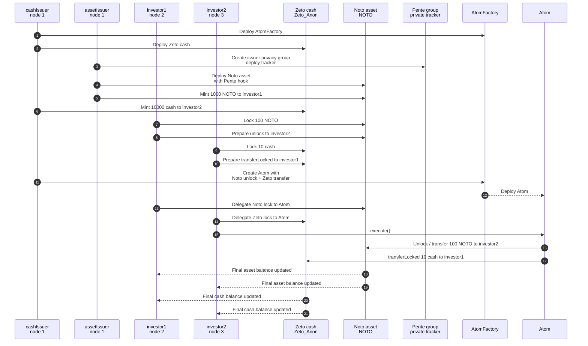

# Example: Atomic Swap

This example demonstrates an atomic swap of a ZKP asset for a private asset, using a custom Atom (atomic transaction) contract. Zeto is used for the ZKP asset, and Noto for the private asset, with Pente for the private logic.

See the [tutorial](https://LFDT-Paladin.github.io/paladin/head/tutorials/atomic-swap/) for a detailed explanation.

## Description du scénario

L'exemple met en scène un échange atomique entre deux investisseurs, coordonné par un contrat public `Atom` :

- `investor1` détient un actif privé Noto (`NOTO`) émis par `assetIssuer`.
- `investor2` détient du cash Zeto anonyme (`Zeto_Anon`) émis par `cashIssuer`.
- `investor1` veut vendre `100` unités d'actif à `investor2`.
- `investor2` paie `10` unités de cash à `investor1`.

Le contrat `Atom` reçoit deux appels déjà préparés : le déverrouillage/transfert de l'actif Noto vers `investor2` et le transfert du cash Zeto verrouillé vers `investor1`. Après délégation des deux verrous à l'adresse de l'Atom, l'appel `execute()` exécute les deux jambes dans une seule transaction publique. Si une jambe échoue, la transaction atomique échoue et l'échange n'est pas partiellement appliqué.

## Déroulement

1. Initialisation de trois clients Paladin et des verifiers `cashIssuer`, `assetIssuer`, `investor1` et `investor2`.
2. Déploiement de la factory `AtomFactory` sur le ledger public.
3. Déploiement du token cash Zeto.
4. Création d'un groupe privé Pente pour `assetIssuer`, puis déploiement du tracker privé ERC-20 utilisé comme hook Noto.
5. Déploiement du token actif Noto configuré en mode notary hooks avec le groupe Pente.
6. Mint initial : `1000` unités d'actif à `investor1` et `10000` unités de cash à `investor2`.
7. Verrouillage des `100` unités d'actif par `investor1`, puis préparation de l'appel de déverrouillage vers `investor2`.
8. Verrouillage des `10` unités de cash par `investor2`, puis préparation du transfert Zeto verrouillé vers `investor1`.
9. Création d'un contrat `Atom` contenant les deux opérations préparées.
10. Délégation du verrou Noto et du verrou Zeto à l'adresse de l'Atom.
11. Exécution de l'Atom, puis vérification des soldes finaux et sauvegarde des données de contrat dans le cache de l'exemple.

## Schéma



## Pre-requisites

Run the common [setup steps](../README.md) before running the example.

## Running the example

```shell
npm install           # install dependencies
npm run copy-abi      # copy relevant ABIs
npm run start         # run the example
```
