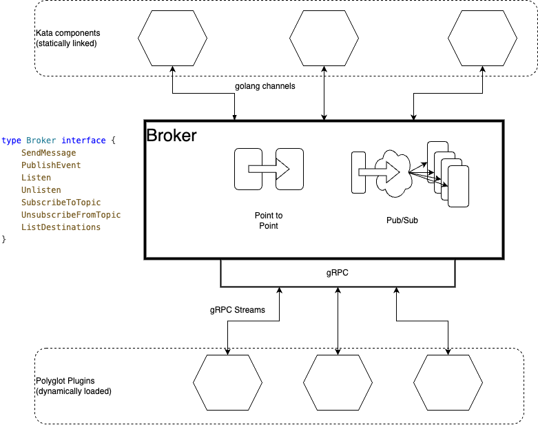

 # Comms Bus

Package commsbus provides a message broker that facilitates communication between different components and a gRPC interface 
to allow communication with components that are developed in different programming langagues.  Components within the 
`github.com/kaleido-io/paladin/kata` module are expected to use the `broker` interface ( although nothing to stop them using gRPC)
and other components, whichever language they are developed in, are expected to use gRPc. 
 
It allows sending messages to specific destinations or broadcasting messages to all destinations subscribed to a topic.

 
 
This package implements the Broker interface, which defines the methods for sending messages, publishing events,
listening for messages, unsubscribing from topics, and listing destinations.

The Broker interface:
 - Listen: Listens for messages sent to a specific destination.
 - SendMessage: Sends a message to a specific destination.
 - SubscribeToTopic: Subscribes a destination to a specific topic.
 - PublishEvent: Publishes an event to all destinations subscribed to a topic.
 - Unlisten: Stops listening for messages sent to a specific destination.
 - UnsubscribeFromTopic: Unsubscribes a destination from a specific topic.
 - ListDestinations: Lists all destinations currently registered with the broker.

The broker implementation in this package uses a map to store the registered destinations and their corresponding message handlers.
It also maintains a map of topic subscriptions to efficiently route events to the subscribed destinations.

## Messages and Events
The `Message` struct represents a message that can be sent to a destination. It contains information such as the destination,
message body, reply-to destination, ID, correlation ID, and message type. 

The Event struct represents an event that can be published to a topic. It contains information such as the topic, event body,
event type, ID, and correlation ID.

Whenever an `Event` is published to a topic, a `Message` is sent to the destination channel for each subscriber to that topic.  
In this case, the `Message` has its `EventID` and `Topic` fields populated.

The MessageHandler struct represents a message handler that can be used to receive messages sent to a specific destination.
It contains a channel where the messages are received.


## Defining messages and events
Messages are defined as protobuf messages.  Current convention is to create a `.proto` file for each component that defines messages.  E.g. currently there is a .proto for 
 - kata.proto: The main definitions of the kata gRPC interface and comms buss
 - plugin.proto: Definitions exchanged between the plugin registry and plugin providers to manage the plugin lifecycle
 - transport.proto: Definitions exhanged between the comms bus and the transport plugins to exchange data with remote nodes

Chose a protobuf package name that is unique for your component.  e.g. currently, we have
 - `package github.com.kaleido_io.paladin.kata`
 - `package github.com.kaleido_io.paladin.kata.plugin`
 - `package github.com.kaleido_io.paladin.kata.transport`

**TODO** Is this a sensible naming convention.  `-` and `/` are not supported so it cannot be an exact match to the golang packages

Define a `go_package` option in your `.proto` file following a similar naming convention to the proto package.  e.g. currently, we have
 - `option go_package = "pkg/proto";`
 - `option go_package = "pkg/proto/plugin";`
 - `option go_package = "pkg/proto/transport";`

NOTE:  techically, any protobuf message can be sent through the commsbus and across the gRPC interface ( even primitive types can be sent if wrapped e.g. using `google.golang.org/protobuf/types/known/wrapperspb`). 
However, following a convention as above to define and document all message types is stongly encouraged and Paladin maintainers should reject any PRs where this convention is not followed. 

## Sending messages
#### When sending over the internal comms bus golang function call
Construct the body as any you would for any golang object, using the go types that were genenerated from the `.proto` files and then assign that object to the `Body` field of the message.
e.g.
```golang
import	pb "github.com/kaleido-io/paladin/kata/pkg/proto/plugin"

createInstanceMessage := &pb.CreateInstance{
	...
}

busMessage := commsbus.Message{
    ID:          messageID,
    Destination: providerName,
    Body:        createInstanceMessage,
}

err := p.commsBus.Broker().SendMessage(ctx, busMessage)
```
#### When sending over a gRPC stream
The body of the message is a `google.protobuf.Any` which is a serialised encoding of the data and the type.  The way you would marshal depends on your programming language.

##### Golang
Construct the golang object for the mesage body using the go types that were generated from the .proto files and then use that object to construct the `github.com/kaleido-io/paladin/kata/pkg/proto.Message` by first converting it to a `google.golang.org/protobuf/types/known/anypb.Any`  e.g. ...

```golang
import (
	pb "github.com/kaleido-io/paladin/kata/pkg/proto"
	transactionsPB "github.com/kaleido-io/paladin/kata/pkg/proto/transaction"
	"google.golang.org/protobuf/types/known/anypb"
)
...
...
submitTransaction := transactionsPB.SubmitTransactionRequest{
		From:            "fromID",
		ContractAddress: "contract",
		Payload: &transactionsPB.SubmitTransactionRequest_PayloadJSON{
			PayloadJSON: "{\"foo\":\"bar\"}",
		},
	}

	requestId := "requestID"
	body, err := anypb.New(&submitTransaction)
	submitTransactionRequest := &pb.Message{
		Destination: "kata-txn-engine",
		Id:          requestId,
		Body:        body,
        ...
	}
```

##### Java
Construct the java object for the message body using the java classes that were generated from the .proto files and then use that object to construct the `Kata.Message` by first `Pack`ing it into a protobuf `any`.  e.g. using the builder pattern, it would look like...
```java
import github.com.kaleido_io.paladin.kata.Kata;
import github.com.kaleido_io.paladin.kata.transaction.Transaction;
import com.google.protobuf.Any;
Transaction.SubmitTransactionRequest submitTransactionRequest = Transaction.SubmitTransactionRequest.newBuilder()
                .setContractAddress(this.contractAddress)
                .setFrom(this.from)
                .setIdempotencyKey(this.idempotencyKey)
                .setPayloadJSON(this.payloadJSON)
                .build();
Any messageBody = Any.pack(submitTransactionRequest);
Kata.Message message = Kata.Message.newBuilder()
        .setBody(messageBody)
        .setId(getId())
        .setDestination("kata-txn-engine")
        .setReplyTo(getTransactionHandler().getDestinationName())
        .build();
```
TODO: the above is not the best example because the `SubmitTransactionRequest` itself has a field named `Payload` that could be confusing here.


## Receiveing messages
### To determine the type of the message

#### When receiveing over a gRPC stream
The body of the message is a `google.protobuf.Any` which is a serialised encoding of the data and the type.  The way you would inspect the actual type and / or unmarshal depends on your programming language.

The type of the message should correspond to the name of the `message` in the .proto file, qualified by the name of the `package`.  E.g. the type for a `NewListenerEvent` event from the main kata.proto file is `github.com.kaleido_io.paladin.kata.NewListenerEvent` and the type for a `PluginReadyEvent` from the `plugin.proto` file is `github.com.kaleido_io.paladin.kata.plugin.PluginReadyEvent`

##### Golang
To unpack the type the payload, assuming `receivedMessage` is a `Message` object as defined by the generated code in `github.com/kaleido-io/paladin/kata/pkg/proto`
```golang
 receivedBody1, err := receivedMessage.GetBody().UnmarshalNew
```

To inspect the type of the payload, first unpack the payload as above, then
```golang
 string(receivedBody1.ProtoReflect().Descriptor().FullName())
```

If you already know the expected type, then you can unpack as follows
```golang
receivedBody := new(pb.NewListenerEvent)
err := any.UnmarshalTo(receivedBody)
```

See https://pkg.go.dev/google.golang.org/protobuf/types/known/anypb#hdr-Unmarshaling_an_Any

##### Java
Assuming you have registered a `StreamObserver` via the `listen` method, you will reveive a `Kata.Message` object for each message.  You can inspect the tpe of the `Body` by getting the `typeURL` and stripping everything up to the last `/` character....
```java
StreamObserver<Kata.Message> listener = new StreamObserver<>() {

            @Override
            public void onNext(Kata.Message message) {
                String typeURL = message.getBody().getTypeUrl();
                int lastSlashIndex = typeURL.lastIndexOf("/");
                String typeName = typeURL;
                if (lastSlashIndex != -1) {
                    typeName = typeURL.substring(lastSlashIndex + 1);
                }
                if (typeName.equals(
                        "github.com.kaleido_io.paladin.kata.plugin.LoadJavaProviderRequest")) {
                            
                    try {
                        LoadJavaProviderRequest body = message.getBody().unpack(LoadJavaProviderRequest.class);
                    }catch{
                        ...
                    }
                }
            }
...
...
asyncStub.listen(ListenRequest.newBuilder().setDestination(destinationName).build(), listener);
```
#### When receiveing over the internal comms bus golang channel

The channel is typed to carry `commsbus.Message` interface objects so you can use golang type assertion to cast anything that implements that interface
```golang
newListenerEvent, ok := receivedEventMessage.Body.(*pb.NewListenerEvent)
```


If you don't know the type, you can query it using `reflect` package and compare it to `TypeFor` of a pointer to the targe type.

```golang
import "reflect
...
eventType := reflect.TypeOf(receivedEvent.Body)
```

and compare it to what you expected using TypeFor
```golang
import (
  "reflect"
  pluginPB "github.com/kaleido-io/paladin/kata/pkg/proto/plugin"
  kataPB "github.com/kaleido-io/paladin/kata/pkg/proto"
)
...
if reflect.TypeOf(receivedEvent.Body) == reflect.TypeFor[*pluginPB.PluginReadyEvent]
    ...
```

Or use a type switch if you want to handle multiple types
```golang
switch bodyType := receivedEvent.Body.(type) {
        case *pluginPB.PluginReadyEvent:
            ...
        case *kataPB.NewListenerEvent:
            ...
        default:
            ...
        }
```
see https://pkg.go.dev/reflect#TypeOf
